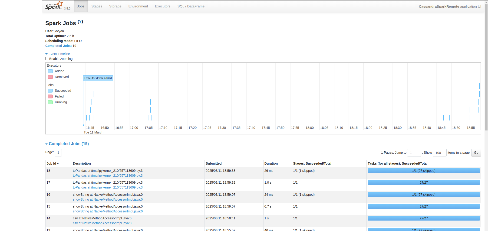
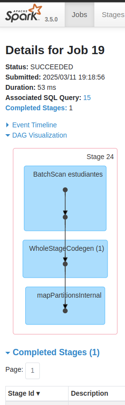
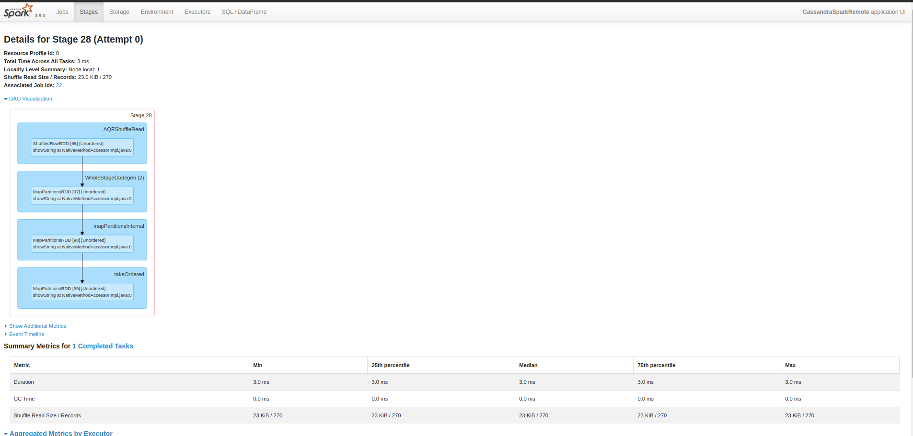
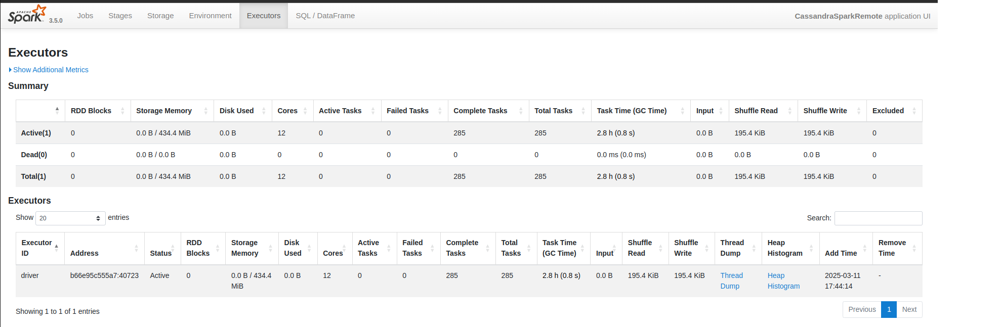

# Proyecto PySpark + Cassandra: Ejercicios Explicados con Análisis en Spark UI

Este proyecto ofrece una serie de ejercicios prácticos para aprender a interactuar con Apache Cassandra usando PySpark. Cada ejercicio incluye:

- Código ejecutable en PySpark
- Explicación del objetivo
- Qué observar en la **Spark UI**
- Sugerencias para capturas de pantalla que ayuden a documentar la ejecución

---

## Introducción a Spark UI

La Spark UI es la herramienta de monitoreo visual de Apache Spark. Se activa automáticamente al ejecutar una acción (como `.show()`, `.count()`, `.write()`, etc.), y permite:

- Observar cómo Spark divide el trabajo en etapas (stages) y tareas (tasks)
- Ver cuántos recursos usa cada operación
- Detectar cuándo ocurre un **shuffle** (reorganización costosa de datos entre nodos)
- Examinar el plan lógico y físico de las consultas

📍 Accede desde: **[http://localhost:4041](http://localhost:4041)** (o el puerto que hayas expuesto en Docker)

### Componentes principales

| Sección      | Qué muestra |
|--------------|-------------|
| **Jobs**     | Lista de todos los trabajos ejecutados |
| **Stages**   | Etapas internas de cada job, clave para detectar `shuffle` |
| **Tasks**    | Detalle de ejecución de cada partición |
| **SQL**      | Plan lógico y físico de las consultas SQL/DataFrame API |
| **Executors**| Estadísticas de uso de CPU, memoria y tareas por nodo |

 

---

## Tabla de partida en Cassandra

```sql
CREATE TABLE bbdd2.estudiantes (
  id int PRIMARY KEY,
  nombre text,
  edad int,
  carrera text
);
```

Se asume precargada con ~25,000 registros.

---

## Ejercicio 1: Leer y explorar datos

**Objetivo:** Leer la tabla desde Cassandra y examinar su estructura.

```python
from pyspark.sql import SparkSession

spark = SparkSession.builder \
    .appName("CassandraSparkRemote") \
    .config("spark.cassandra.connection.host", "172.17.0.1") \
    .getOrCreate()

df = spark.read \
    .format("org.apache.spark.sql.cassandra") \
    .options(table="estudiantes", keyspace="bbdd2") \
    .load()

df.show(10)
```

**Spark UI:**
- Jobs: se ve un solo DAG muy simple.
- Stages: una etapa de lectura desde Cassandra.
- SQL: si haces `df.select(...)`, puedes ver la consulta.

    <p align="center">
        
    </p>


---

## Ejercicio 2: Filtros simples

**Objetivo:** Filtrar estudiantes mayores de 25 años.

```python
df.filter(df.edad > 25).select("nombre", "edad", "carrera").show()
```

**Spark UI:**
- Una sola etapa.
- Sin `shuffle`.
- Tiempos por tarea mínimos.

---

## Ejercicio 3: Agrupación por carrera

**Objetivo:** Contar estudiantes por carrera.

```python
df.groupBy("carrera").count().orderBy("count", ascending=False).show()
```

**Spark UI:**
- Aparecen múltiples stages.
- Uno para agregación (`Shuffle Write`), otro para ordenamiento (`Sort`).
- Alta actividad de `Shuffle Read`.

💡 **Sugerencia visual:** Captura del stage con `Shuffle Read Size`.

<p align="center">
    
</p>

---

## Ejercicio 4: Columna derivada 'grupo_edad'

**Objetivo:** Añadir columna que clasifique estudiantes en 'Joven' o 'Adulto'.

```python
from pyspark.sql.functions import when

df_cat = df.withColumn("grupo_edad", when(df.edad < 25, "Joven").otherwise("Adulto"))
df_cat.select("nombre", "edad", "grupo_edad").show()
```

**Spark UI:** transformación simple, aparece como `Project`.

---

## Ejercicio 5: Guardar estudiantes adultos en Cassandra

**Objetivo:** Filtrar estudiantes adultos (edad ≥ 25) y guardar en tabla `estudiantes_adultos`.

```sql
-- En Cassandra
CREATE TABLE bbdd2.estudiantes_adultos (
  id int PRIMARY KEY,
  nombre text,
  edad int,
  carrera text
);
```

```python
from pyspark.sql.functions import col

df_adultos = df.filter(col("edad") >= 25)

df_adultos.write \
  .format("org.apache.spark.sql.cassandra") \
  .mode("append") \
  .options(table="estudiantes_adultos", keyspace="bbdd2") \
  .save()
```

**Spark UI:**
- DAG con escritura persistente.
- Ver última etapa y tiempo por tarea.
- Executors: monitorea si el driver tuvo carga alta.

---

## Ejercicio 6: Filtrar por nombre y ordenar

```python
df.filter(df.nombre.startswith("M")).orderBy("edad", ascending=False).show()
```

**Spark UI:**
- Stages: aparecen operaciones de `SortExec`.
- Requiere `shuffle` y uso intensivo de memoria si hay muchas filas.

---

## Ejercicio 7: Consultas SQL

```python
df.createOrReplaceTempView("estudiantes")

spark.sql("""
    SELECT carrera, AVG(edad) AS edad_promedio
    FROM estudiantes
    GROUP BY carrera
    ORDER BY edad_promedio DESC
""").show()
```

**Spark UI:**
- Se activa la pestaña **SQL**.
- Puedes inspeccionar el árbol de ejecución físico.
- Verás operaciones como `HashAggregate` y `SortExec`.

```plaintext
== Physical Plan ==
AdaptiveSparkPlan (14)
+- == Final Plan ==
    TakeOrderedAndProject (8)
    +- * HashAggregate (7)
        +- AQEShuffleRead (6)
            +- ShuffleQueryStage (5), Statistics(sizeInBytes=14.3 KiB, rowCount=270)
                +- Exchange (4)
                    +- * HashAggregate (3)
                        +- * Project (2)
                            +- BatchScan estudiantes (1)
+- == Initial Plan ==
    TakeOrderedAndProject (13)
    +- HashAggregate (12)
        +- Exchange (11)
            +- HashAggregate (10)
                +- Project (9)
                    +- BatchScan estudiantes (1)


(1) BatchScan estudiantes
Output [2]: [carrera#322, edad#323]
Cassandra Scan: bbdd2.estudiantes
 - Cassandra Filters: []
 - Requested Columns: [carrera,edad]

(2) Project [codegen id : 1]
Output [2]: [carrera#322, edad#323]
Input [2]: [carrera#322, edad#323]

(3) HashAggregate [codegen id : 1]
Input [2]: [carrera#322, edad#323]
Keys [1]: [carrera#322]
Functions [1]: [partial_avg(edad#323)]
Aggregate Attributes [2]: [sum#403, count#404L]
Results [3]: [carrera#322, sum#405, count#406L]

(4) Exchange
Input [3]: [carrera#322, sum#405, count#406L]
Arguments: hashpartitioning(carrera#322, 200), ENSURE_REQUIREMENTS, [plan_id=478]

(5) ShuffleQueryStage
Output [3]: [carrera#322, sum#405, count#406L]
Arguments: 0

(6) AQEShuffleRead
Input [3]: [carrera#322, sum#405, count#406L]
Arguments: coalesced

(7) HashAggregate [codegen id : 2]
Input [3]: [carrera#322, sum#405, count#406L]
Keys [1]: [carrera#322]
Functions [1]: [avg(edad#323)]
Aggregate Attributes [1]: [avg(edad#323)#392]
Results [2]: [carrera#322, avg(edad#323)#392 AS edad_promedio#391]

(8) TakeOrderedAndProject
Input [2]: [carrera#322, edad_promedio#391]
Arguments: 21, [edad_promedio#391 DESC NULLS LAST], [toprettystring(carrera#322, Some(Etc/UTC)) AS toprettystring(carrera)#397, toprettystring(edad_promedio#391, Some(Etc/UTC)) AS toprettystring(edad_promedio)#398]

(9) Project
Output [2]: [carrera#322, edad#323]
Input [2]: [carrera#322, edad#323]

(10) HashAggregate
Input [2]: [carrera#322, edad#323]
Keys [1]: [carrera#322]
Functions [1]: [partial_avg(edad#323)]
Aggregate Attributes [2]: [sum#403, count#404L]
Results [3]: [carrera#322, sum#405, count#406L]

(11) Exchange
Input [3]: [carrera#322, sum#405, count#406L]
Arguments: hashpartitioning(carrera#322, 200), ENSURE_REQUIREMENTS, [plan_id=465]

(12) HashAggregate
Input [3]: [carrera#322, sum#405, count#406L]
Keys [1]: [carrera#322]
Functions [1]: [avg(edad#323)]
Aggregate Attributes [1]: [avg(edad#323)#392]
Results [2]: [carrera#322, avg(edad#323)#392 AS edad_promedio#391]

(13) TakeOrderedAndProject
Input [2]: [carrera#322, edad_promedio#391]
Arguments: 21, [edad_promedio#391 DESC NULLS LAST], [toprettystring(carrera#322, Some(Etc/UTC)) AS toprettystring(carrera)#397, toprettystring(edad_promedio#391, Some(Etc/UTC)) AS toprettystring(edad_promedio)#398]

(14) AdaptiveSparkPlan
Output [2]: [toprettystring(carrera)#397, toprettystring(edad_promedio)#398]
Arguments: isFinalPlan=true
```

---

## Ejercicio 8: Exportar a CSV

```python
df.write.option("header", True).mode("overwrite").csv("/home/jovyan/work/export_estudiantes")
```

**Spark UI:** muchos tasks pequeños si el archivo es particionado (por defecto).

---

## Ejercicio 9: Agrupación doble

```python
df_cat.groupBy("carrera", "grupo_edad").avg("edad").show()
```

**Spark UI:**
- Alta actividad de `shuffle`.
- Múltiples agregaciones.

---

## Ejercicio 10: Visualización con Pandas

```python
import matplotlib.pyplot as plt

df_pandas = df.groupBy("carrera").count().toPandas()

df_pandas.plot(kind="bar", x="carrera", y="count", figsize=(10, 5))
plt.title("Estudiantes por carrera")
plt.show()
```

**Nota:** esta parte ocurre fuera de Spark. Solo verás en UI la lectura previa del DataFrame.

---


<p align="center">
    
</p>


---

# Ejercicios adicionales propuestos

1. Filtrar estudiantes cuya carrera contenga la palabra `"Ingeniería"`.
2. Calcular cuántos estudiantes tienen exactamente 25 años.
3. Calcular el promedio de edad por carrera **solo para estudiantes jóvenes** (`<25`).
4. Contar cuántos estudiantes hay por cada grupo de edad y exportarlo a JSON.
5. Realizar un `join` entre dos tablas: `estudiantes` y `estudiantes_adultos`, comparando coincidencias por ID.
6. Crear una nueva tabla en Cassandra que contenga `carrera`, `grupo_edad` y `count`, y escribirla desde Spark usando `.write`.

---

- Explora los DAGs, stages, tasks y tiempos en la Spark UI:  
- http://localhost:4041 (o el puerto que hayas configurado)
