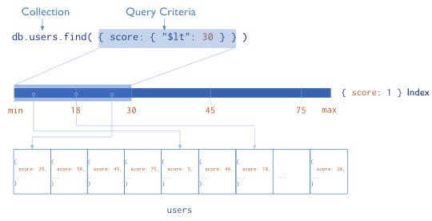

<!-- _class: titlepage -->

# MongoDB - Bases de datos documentales

## Bases de datos II

### Edgar Talavera Muñoz (<small><e.talavera@upm.es></small>)

#### Departamento de Sistemas Informáticos

##### Escuela Técnica superior de Ingeniería de Sistemas Informáticos

[](https://creativecommons.org/licenses/by-nc-sa/4.0/)

---
<style scoped>
h1{text-align: right}
h2 { color:grey; text-align: right}
</style>

<!-- _class: section -->
# Característica avanzadas de MongoDB
## ¿Qué hace a MongoDB diferente?

---

# ***Índices***

- Los índices **incrementan el rendimiento** de las operaciones de lectura más frecuentes

- Sin los índices habría que recorrer todos los documentos para encontrar los que coincidan con la consulta realizada





---
<style scoped>
h1 {text-align:left}
{font-size:1.2rem; text-align:center}
</style>
# Índices

| **Default _id** | All MongoDB collections have an index on the _id field that exists by default |
|----------|----------|
| **Single Field**    | MongoDB supports user-defined indexes on a single field of a document   |
| C**ompound Index**  | MongoDB supports user-defined indexes on multiple fields   |
| **Multikey Index**    | MongoDB uses multikey indexes to index the content stored in arrays. If you index a field that holds an array value, MongoDB creates separate index entries for every element of the array   |
| **Geospatial Index**    | MongoDB provides two special indexes: 2d indexes that uses planar geometry when returning results and 2sphere indexes that use spherical geometry to return results   |
| **Text Indexes**    | MongoDB provides a text index type that supports searching for string content in a collection. These text indexes do not store language-specific stop words (e.g. “the”, “a”, “or”) and stem the words in a collection to only store root words   |
| **Hashed Indexes**   | MongoDB provides a hashed index type, which indexes the hash of the value of a field   |

---

# Índices

El método ```createIndex()``` permite crear un índice en una colección determinada y acepta **dos parámetros**: 
- el primero es un objeto que especifica los campos que se van a indexar 
- el segundo es un objeto que especifica las opciones del índice. 

```python
db.movies.createIndex({ year: 1 })
```

La eliminación de índices en MongoDB es posible utilizando ```dropIndex()```.

Se pueden exploración índices con la función ```explain()``` que se puede utilizar para explorar cómo se están utilizando los índices en una consulta determinada.

---

# Índices - **resumen**

- **Mejora el rendimiento**: mejoran el rendimiento de las consultas.

- **Estructuras de datos**: se utilizan estructuras de índices basadas en árboles B para indexar los datos. 

- **Tipos de índices**: soporta varios tipos de índices (simples, compuestos, de texto, geoespaciales, etc.)

- **Actualización de índices**: Los índices en MongoDB se actualizan automáticamente cuando se realizan cambios en la colección. Sin embargo, si se realizan muchos cambios en la colección, puede ser necesario recrear el índice para mantener un buen rendimiento.

- **Uso de índices**: utiliza índices automáticamente para acelerar las consultas que utilizan los campos indexados.

---

# ***Replica Set***

Un **replica set** en MongoDB es un ***conjunto de servidores*** que trabajan juntos para proporcionar alta disponibilidad, redundancia y escalabilidad. 

Consta de varios nodos, que son servidores de MongoDB que almacenan copias idénticas de los datos de la base de datos.

- Las replicas permiten sincronizar datos entre múltiples servidores
- Proporciona redundancia e incrementa la disponibilidad y la tolerancia a fallos
- Las replicas pueden mejorar el rendimiento de las lecturas

---

# Replica Set

- El ***primario*** acepta las operaciones de los clientes
- Los ***secundarios*** replican las operaciones del primario en sus datos


--- 

# Replica Set

- Cuando el ***primario*** no se comunica con los otros miembros durante más de 10 segundos, el conjunto de replicas busca un nuevo primario. El secundario que recibe más votos se convierte en primario.


---
<style scoped>
h1 {text-align:left}
table{font-size:0.8rem; text-align:center}
</style>

# Replica Set

- Replica Set puede **mejorar** el rendimiento de las lecturas
- MongoDB soporta **5 modos** de lectura:

| **primary** | Default mode. All operations read from the current replica set primary. |
|----------|----------|
| **primaryPreferred**    | In most situations, operations read from the primary but if it is unavailable, operations read from secondary members.  |
| **secondary**    | All operations read from the secondary members of the replica set.  |
| **secondaryPreferred**    | In most situations, operations read from secondary members but if no secondary members are available, operations read from the primary.  |
| **nearest**    | IOperations read from member of the replica set with the least network latency, irrespective of the member’s type.  |

---

# ***Sharding***

- Sharding es una forma de **guardar datos en diferentes máquinas**
- MongoDB utiliza sharding para sistemas con **conjuntos de datos enormes** y **mucha carga de entrada-salida**
- Existen dos formas de **escalar** una base de datos:
  - **La escalabilidad vertical** añade más CPU y memoria para mejorar la capacidad del sistema
  - **Sharding** o escalabilidad horizontal, divide los datos y los distribuyen entre different servidores (shards). Cada shard es una base de datos independiente y todos los shards juntos forman una base de datos.

---

# Sharding


---

<style scoped>
{font-size:1.7rem;}
</style>

# Sharding

- Sharding aborda el **reto de la escalabilidad** para soportar altas tasas de entreda/salidad en grades conjuntos de datos:
  - **Reduce el número de operaciones** que maneja cada shard.
  - **Reduce la cantidad de información** que cada shard tiene que almacenar.
- MongoDB distribuye los datos **a nivel de colección**
- Sharding distribuye los datos basándose en una **shard key**
  - Una shard key es un **campo indexable** que existe en cualquier documento de la colección
  - MongoDB divide los valores de la shard key en chunks y distribuye los **chunks** entre los shards
  - Existen dos formas de dividir la shard key: **range based partitioning** o **hash based partitioning**

---

# Sharding

- **Range-based sharding**: MongoDB divide los datos en rangos basándose en los valores que toma la shard key.


---

# Sharding

- **Range-based sharding**: MongoDB divide los datos en rangos basándose en los valores que toma la shard key.


---