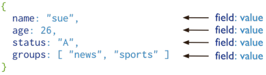

<!--
_header: ''
_footer: <br>Esta obra está bajo una [licencia de Creative Commons Reconocimiento-NoComercial-CompartirIgual 4.0 Internacional](http://creativecommons.org/licenses/by-nc-sa/4.0/). Icono diseñado por Flaticon
-->
<style>
img[alt~="center"] {
  display: block;
  margin: 0 auto;
}
img {
  background-color: transparent!important;
}
li {
  text-align: justify;
}
</style>


# TEMA 3.1

**Mongodb** - bases de datos documentales

---
<style scoped>
{ font-size: 1.4rem; }
</style>
## Introducción

# Introducción a Mongodb

---

# Sistemas de almacenamiento

- Datos **estructurados**
  - Hojas de calculo
  - Bases de datos relacionales
- Datos **semi-estructurados** o **no estructurados**
  - Se necesita un rediseño del sistema de almacenamiento

---
# Características de Mongodb

- MongoDB ("humongous") es una **base de datos orientada a documentos**
- Lídes de las bases de datos **NoSQL**
- Es **gratis** y **open-source**
- Usa **UTF-8** como codificación
- http://www.mongodb.org/
---
<style scoped>
p { font-size: 0.7rem; }
li { font-size: 0.7rem}
</style>

# JSON: JavaScript Object Notation

- La información en MongoDB utiliza un formato basado en **JSON** para su sintaxis:
```
 {
   "clientes":
   [
      {
        "apellido":"Alonso", 
        "gasto": 100, 
        "es_habitual": true,
        "productos": [
                        "P001", 
                        "P032", 
                        "P099"
                      ]
      },
    ...
   ]
 }
```
---

# Mongodb vs SQL

 

---

# Documentos

- MongoDB almacena la información en forma de **documentos**
  - ... que son pares clave-valor en formato **JSON**
  
 


---

# Colecciones

- MongoDB almacena todos los documentos en **colecciones**

  - Una colección es un **grupo de documentos relacionados** semánticamente

 

---

# Queries

- En MongoDB las consultas se hacen sobre una colección de documentos

  - Se especifican los criterios de los documentos a recuperar


 


--- 

# Conceptos básicos

- Los documentos en MongoDB tienen un **esquema flexible**
  - Las colecciones de MongoDB **no obligan a que sus documentos tengan un formato único**

- Una colección puede tener varios documentos con una estructura diferente
  - En la práctica los documentos de una colección comparten una estructura similar
  - Todos los documentos tendrán un campo _id


---

# Relaciones entre documentos

- ¿Cómo se representan las **relaciones** entre los datos?
- Existen **dos** formas de hacerlo:
  - **Referencias** a otros documentos
  - **Subdocumentos**
> Se permite (y aconseja) duplicar información


---

# Modelo normalizado

Ejemplo de modelo normalizado para Mongodb

 

---

# Modelo con subdocumentos

Ejemplo de modelo embedido para Mongodb

 

---

# ¿Solución óptima?

La clave cuando modelamos es **balancear**:

- Las necesidades de la aplicación

- El rendimiento

- Las consultas que realizamos a los datos

- El modelo de datos está altamente relacionado con el **uso** que hacemos de los datos

---

# Ejemplo con Movielens

- Sistema de votación de películas
- Disponemos de:
  - Usuarios
  - Películas
  - Cada usuario puede votar tantas películas como desee


---

# Ejemplo con Movielens

- Modelo Normalizado:

 

---

<style scoped>
li { font-size: 0.9rem}
</style>

# Ejemplo con Movielens

- Ventajas del modelo Normalizado:

  -  Normalizado
  -  Sin información duplicada
  -  Un cambio en una votación se actualiza al instante

- Desventajas del modelo Normalizado:
  - Lento
  - No sigue la filosofía de MongoDB
  - Recuperar todos los votos de una película implica varias consultas

---

# Ejemplo con Movielens

- Modelo orientado a películas:

 

---
<style scoped>
li { font-size: 0.9rem}
</style>

# Ejemplo con Movielens

- Ventajas del modelo orientado a películas:

  -  Acceso inmediato a los votos de cada película

- Desventajas del modelo orientado a películas:
  - Recupera los votos de un usuario es más lento
  - Actualizar un voto es lento
  - Si una película tiene muchos votos el tamaño del objeto en disco puede ser demasiado grande

---

# Ejemplo con Movielens

- Modelo orientado a ucuarios:

 

---
<style scoped>
li { font-size: 0.9rem}
</style>

# Ejemplo con Movielens

- Ventajas del modelo orientado a ucuarios:

  -  Acceso inmediato a los votos del usuario
  -  Acceso inmediato a las fichas de las películas votadas por el usuario

- Desventajas del modelo orientado a ucuarios:
  - Duplica información
  - El objeto usuario puede ser muy grande si vota muchas películas
  - Un cambio en una fichar de una película implica actualizar información en los usuarios

---

# Ejemplo con Movielens

- Modelo mixto:

 

---

# Ejemplo con Movielens

- Modelo mixto:

 

---

# Ejemplo con Movielens

- Ventajas del modelo mixto:

  - Acceso inmediato a la información de los votos de las películas
  - Acceso inmediato a la información de los votos de los usuarios
- Desventajas del modelo mixto:
  - Mucha información duplicada
  - Objetos muy grandes

---

# Ejemplo con Movielens

- Debemos responder a las siguientes preguntas:
  - ¿Es frecuente actualizar los votos?
  - ¿Es necesario conocer quién votó cada película?
  - ¿Cada cuanto cambiamos la ficha de una película?
  - ¿Puede un usuario modificar su nick?
  - ...

---

# Aspectos clave

- MongoDB es flexible
- No existen normas para modelar la base de datos
- Solamente existen una serie de buenos consejos
- Debemos pensar en el uso de los datos
- Se puede (y se aconseja) duplicar información

---
<style scoped>
{ font-size: 1.8rem; }
</style>
## Introducción a Mongodb

# Operaciones

---

# Operaciones

- MongoDB ofrece soporte para:
  - Escritura (**C**reate)
  - Lectura (**R**ead)
  - Modificación (**U**pdate)
  - Borrado (**D**elete)


---
<style scoped>
h4{ color: orange; font-size:1.2rem;}
{font-size:1.1rem;}
</style>
# Consultas léctura básicas

**db.collection.find()**  -> operación equivalente al operador **WHERE** en SQL

#### Leer todas las películas
-  ``db.movies.find({}) ``
#### Leer todas las películas que se estrenaron en 1995
- ``db.movies.find({year: 1995})``
#### Las películas que se estrenaron en 1995 y empiezan por 'A'
- ``db.movies.find({year: 1995, title: {$regex: "^A"}})``
#### Las películas que se estrenaron entre 1995 y 1997
- ``db.movies.find({year: {$gte: 1995}, year: {$lte: 1997}})``
- ``db.movies.find({year: {$gte: 1995, $lte: 1997}})``
