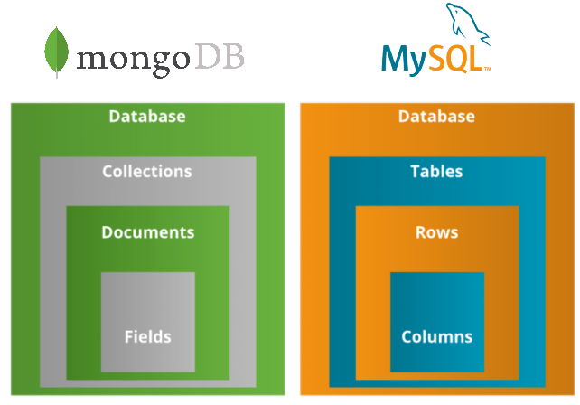
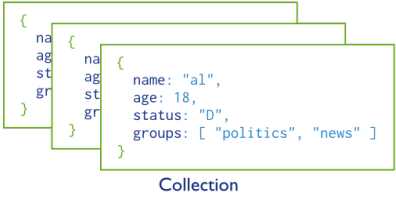
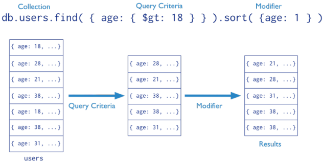
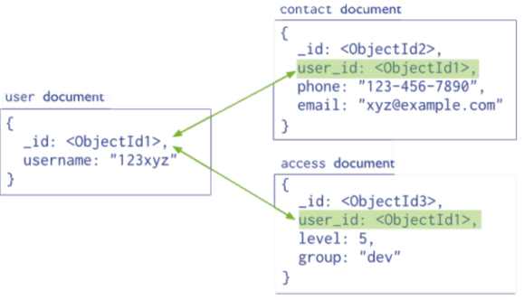
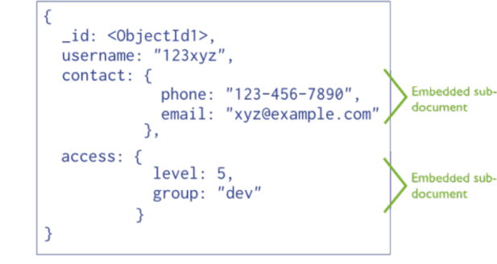
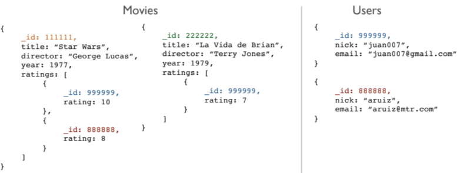
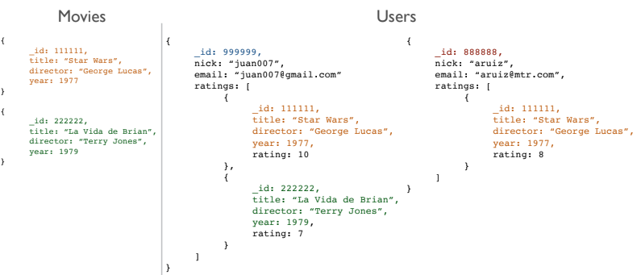

<!-- _class: titlepage -->

# MongoDB - Bases de datos documentales

## Bases de datos II

### Edgar Talavera Muñoz (<small><e.talavera@upm.es></small>)

#### Departamento de Sistemas Informáticos

##### Escuela Técnica superior de Ingeniería de Sistemas Informáticos

[](https://creativecommons.org/licenses/by-nc-sa/4.0/)

---

<!-- _class: section -->
# Introducción a MongoDB

---

# Sistemas de almacenamiento

Datos **estructurados**

- Hojas de calculo
- Bases de datos relacionales

Datos **semi-estructurados** o **no estructurados**

- Se necesita un rediseño del sistema de almacenamiento

---

# Características de Mongodb

Es un motor open-source de **base de datos documental** de código abierto

- MongoDB ("humongous"), disponible en <http://www.mongodb.org>
- Líder de las bases de datos **NoSQL**

Licenciado bajo licencias libres

- Primero [GNU AGPL v3.0](https://www.gnu.org/licenses/agpl-3.0.html), ahora [Server Side Public License (SSPL)](https://www.mongodb.com/licensing/server-side-public-license)
- Existen disponibles licencias comerciales para su uso en aplicaciones cerradas

Usa **UTF-8** como codificación (por defecto)

---

# JSON: JavaScript Object Notation

La información en MongoDB utiliza un formato basado en **JSON** para su sintaxis:

```json
{
  "clientes": [
    {
      "apellido":"Alonso", 
      "gasto": 100, 
      "es_habitual": true,
      "productos": ["P001", "P032", "P099"]
    },
    ...
  ]
}
```
---

# MongoDB vs SQL

<center>

 
</center>

---

# Documentos

MongoDB almacena la información en forma de **documentos**

- ... que son pares clave-valor en formato **JSON**

```json
{
  "clave": "valor",
  "nombre": "Edgar",
  "edad": 28,
  "hobbies": ["Correr", "Ciclismo", "Motos"]
}
```

---

# Colecciones

MongoDB almacena todos los documentos en **colecciones**

- Una colección es un **grupo de documentos relacionados** semánticamente

<center>

 
</center>

---

# Queries

En MongoDB las consultas se hacen sobre una colección de documentos

- Se especifican los criterios de los documentos a recuperar


 


---

# Conceptos básicos

Los documentos en MongoDB tienen un **esquema flexible**

- Las colecciones **no obligan a que sus documentos tengan un formato único**

Una colección puede tener varios documentos con una estructura diferente

- En la práctica los documentos de una colección comparten una estructura similar
- Todos los documentos tendrán un campo `_id`

---

# Relaciones entre documentos

¿Cómo se representan las **relaciones** entre los datos? Dos formas:

- **Referencias** a otros documentos
- **Subdocumentos**

> Se permite (y aconseja) duplicar información

---

# Modelo normalizado

Ejemplo de modelo normalizado para Mongodb

 

---

# Modelo con subdocumentos

Ejemplo de modelo embedido para Mongodb

 

---

# ¿Solución óptima?

La clave cuando modelamos es **balancear**:

- Las necesidades de la aplicación

- El rendimiento

- Las consultas que realizamos a los datos

- El modelo de datos está altamente relacionado con el **uso** que hacemos de los datos

---

# Ejemplo con Movielens

- Sistema de votación de películas
- Disponemos de:
  - Usuarios
  - Películas
  - Cada usuario puede votar tantas películas como desee


---

# Ejemplo con Movielens

- Modelo Normalizado:

 

---

<style scoped>
li { font-size: 0.9rem}
</style>

# Ejemplo con Movielens

- Ventajas del modelo Normalizado:

  -  Normalizado
  -  Sin información duplicada
  -  Un cambio en una votación se actualiza al instante

- Desventajas del modelo Normalizado:
  - Lento
  - No sigue la filosofía de MongoDB
  - Recuperar todos los votos de una película implica varias consultas

---

# Ejemplo con Movielens

- Modelo orientado a películas:

 

---
<style scoped>
li { font-size: 0.9rem}
</style>

# Ejemplo con Movielens

- Ventajas del modelo orientado a películas:

  -  Acceso inmediato a los votos de cada película

- Desventajas del modelo orientado a películas:
  - Recupera los votos de un usuario es más lento
  - Actualizar un voto es lento
  - Si una película tiene muchos votos el tamaño del objeto en disco puede ser demasiado grande

---

# Ejemplo con Movielens

- Modelo orientado a usuarios:

 

---
<style scoped>
li { font-size: 0.9rem}
</style>

# Ejemplo con Movielens

- Ventajas del modelo orientado a ucuarios:

  -  Acceso inmediato a los votos del usuario
  -  Acceso inmediato a las fichas de las películas votadas por el usuario

- Desventajas del modelo orientado a ucuarios:
  - Duplica información
  - El objeto usuario puede ser muy grande si vota muchas películas
  - Un cambio en una fichar de una película implica actualizar información en los usuarios

---

# Ejemplo con Movielens

- Modelo mixto:

 

---

# Ejemplo con Movielens

- Modelo mixto:

 

---

# Ejemplo con Movielens

- Ventajas del modelo mixto:

  - Acceso inmediato a la información de los votos de las películas
  - Acceso inmediato a la información de los votos de los usuarios
- Desventajas del modelo mixto:
  - Mucha información duplicada
  - Objetos muy grandes

---

# Ejemplo con Movielens

- Debemos responder a las siguientes preguntas:
  - ¿Es frecuente actualizar los votos?
  - ¿Es necesario conocer quién votó cada película?
  - ¿Cada cuanto cambiamos la ficha de una película?
  - ¿Puede un usuario modificar su nick?
  - ...

---

# Aspectos clave

- MongoDB es flexible
- No existen normas para modelar la base de datos
- Solamente existen una serie de buenos consejos
- Debemos pensar en el uso de los datos
- Se puede (y se aconseja) duplicar información

---

<!-- _class: section -->
# Operaciones en MongoDB

---

# Tipos de operaciones

MongoDB ofrece soporte para:

- Escritura (**C**reate)
- Lectura (**R**ead)
- Modificación (**U**pdate)
- Borrado (**D**elete)

---

# Consultas básicas

`db.collection.find()`: Recupera documentos de una colección

- Todas las películas:
  ```python
  db.movies.find({})
  ```
- Todas las estrenadas en 1995:
  ```
  db.movies.find({year: 1995})
  ```
- Todas las estrenadas en 1995 y empiezan por 'A' (`i` $\rightarrow$ case insensitive):
  ```python
  db.movies.find({year: 1995, title: {$regex: "^A", options: "i"}})  # O $regex: /^A/i
  ```
- Películas estrenadas entre 1995 y 1997:
  ```python
  db.movies.find({year: {$gte: 1995}, year: {$lte: 1997}})
  ```

---
<style scoped>
h4{ color: grey; font-size:1.4rem; line-height: 0}
h3{ color: green; font-size:1.4rem; line-height: 0}
{font-size:1.4rem;}
h2{line-height: 0}
</style>
# Consultas básicas - Operadores de **selección**
## `db.collection.find()` - Operadores lógicos **$and**

- ### Sintaxis
  -  ``{ $and: [ { <expression1> }, { <expression2> }, ... , { <expressionN> } ] }``
- #### Las películas de comedia lanzadas en 2000
  - ``db.movies.find({ $and: [  { genres: "Comedy" },  { year: 2000 } ] })``

## `db.collection.find()` - Operadores lógicos **$or**

- ### Sintaxis
  -  ``{ $or: [ { <expression1> }, { <expression2> }, ... , { <expressionN> } ] }``
- #### Las películas que sean de comedia o que hayan sido lanzadas en 2000
  - ``db.movies.find({ $or: [ { genres: "Comedy" }, { year: 2000 }  ]})``
---

<style scoped>
h4{ color: grey; font-size:1.4rem; line-height: 0}
h3{ color: green; font-size:1.4rem; line-height: 0}
{font-size:1.4rem;}
h2{line-height: 0}
</style>
# Consultas básicas - Operadores de **selección**
## Método db.collection.find() - Operadores lógicos **$nor**

- ### Sintaxis
  -  ``{ $nor: [ { <expression1> }, { <expression2> }, ...  { <expressionN> } ] }``
- #### Todas las películas que no sean de comedia y que no hayan sido lanzadas en 2000
  - ``db.movies.find({   $nor: [  { genres: "Comedy" },     { year: 2000 }  ]})``

## Método db.collection.find() - Operadores lógicos **$not**

- ### Sintaxis
  -  ``{ field: { $not: { <operator-expression> } } }``
- #### Las películas que no sean de comedia
  - ``db.movies.find({  genres: { $not: { $eq: "Comedy" } } })``
---

<style scoped>
h4{ color: grey; font-size:1.4rem; line-height: 0}
h3{ color: green; font-size:1.4rem; line-height: 0}
{font-size:1.4rem;}
h2{line-height: 0}
</style>
# Consultas básicas - Operadores de **selección**
## Método db.collection.find() - Operadores de comparación **$eq**
- ### Sintaxis
  -  ``{ <field>: { $eq: <value> } }``
- #### Las películas que fueron lanzadas en el año 2016
  - ``db.movies.find({   year: { $eq: 2016 } })``

## Método db.collection.find() - Operadores de comparación **\$gt** y **$lt**
- ### Sintaxis
  -  ``{ field: { $gt: value } } || { field: { $lt: value } }``
- #### Las películas con un rating mayor a 8.0 y menor a 8.5
  - ``db.movies.find({   rating: { $gt: 8.0, $lt: 8.5 }})``

>Se puede usar $gte y $lte para menor o igual y mayor o igual
---

<style scoped>
h4{ color: grey; font-size:1.4rem; line-height: 0}
h3{ color: green; font-size:1.4rem; line-height: 0}
{font-size:1.4rem;}
h2{line-height: 0}
</style>
# Consultas básicas - Operadores de **selección**
## Método db.collection.find() - Operadores de cojuntos **$in**
- ### Sintaxis 
  - ``{ field: { $in: [<value1>, <value2>, ... <valueN> ] } }``
- #### Las películas que sean de los géneros "Comedy" o "Drama"
  - ``db.movies.find({  genres: { $in: ["Comedy", "Drama"] } })``

## Método db.collection.find() - Operadores de cojuntos **$nin**
- ### Sintaxis
  - ``{ field: { $nin: [ <value1>, <value2> ... <valueN> ]}}``
- #### Las películas que no sean de los géneros "Comedy" ni "Drama"
  - ``db.movies.find({  genres: { $nin: ["Comedy", "Drama"] } })``

---

<style scoped>
h4{ color: grey; font-size:1.4rem; line-height: 0}
h3{ color: green; font-size:1.4rem; line-height: 0}
{font-size:1.4rem;}
h2{line-height: 0}
</style>
# Consultas básicas - Operadores de **selección**
## Método db.collection.find() - Operadores de cojuntos **$all**
### Sintaxis 
``{ field : { $all: [ <value1> , <value2> ... ] } }``
#### Las películas que sean de los géneros **"Comedy" y "Drama"**
``db.movies.find({  genres: { $all: ["Action", "Drama"] } })``

## Método db.collection.find() - Operadores de cojuntos **$size**
### Sintaxis
``{ field: { $size: value } }``
#### Todas las películas que tengan exactamente tres actores
``db.movies.find({  actors: { $size: 3 }})``

---

<style scoped>
h4{ color: grey; font-size:1.4rem; line-height: 0}
h3{ color: green; font-size:1.4rem; line-height: 0}
{font-size:1.1rem;}
h2{line-height: 0}
</style>
# Consultas básicas - Operadores de **selección**
## Método db.collection.find() - Operadores de cojuntos **$regex**
### Sintaxis 
``{ field : { $all: [ <value1> , <value2> ... ] } }``
#### Películas que contengan la palabra "love" en su título.
``db.movies.find({ title: { $regex: /love/i } })``
### Operadores de las expresiones regulares
- ^ : Coincide con el comienzo de una cadena de texto.
- $ : Coincide con el final de una cadena de texto.
- . : Coincide con cualquier carácter excepto los caracteres de nueva línea.
- [] : Define un conjunto de caracteres posibles que pueden aparecer en esa posición.
- [^] : Define un conjunto de caracteres que no deben aparecer en esa posición.
- \* : Coincide con cero o más ocurrencias del carácter anterior.
- \+ : Coincide con una o más ocurrencias del carácter anterior.
- ? : Coincide con cero o una ocurrencia del carácter anterior.
- {} : Especifica un rango de repeticiones del carácter anterior.
- () : Agrupa un conjunto de caracteres y crea un grupo de captura.
- | : Utilizado para especificar múltiples opciones de coincidencia.


---
<style scoped>
{font-size:1.4rem;}
</style>
# Consultas básicas - Operadores de **proyección**
`db.collection.find()`: También puede definir los campos a devolver - "SELECT"


- Título e _id de las películas de 1995:
```python
db.movies.find({year: 1995}, {title:1, _id: 0}) 
```
- Todos los datos menos "ratings" de las películas de 1995:
```python
db.movies.find({year: 1995}, {ratings:0})
```
`db.collection.find()`: También podemos definir el órden - "ORDER BY"

- Todas las películas ordenadas por año ascendente:
```python
db.movies.find({}).sort({year: 1})
```
- Todas las películas ordenadas por año descendente:
```python
db.movies.find({}).sort({year: -1})
```

---

<style scoped>
h4{ color: grey; font-size:1.4rem; line-height: 0}
h3{ color: green; font-size:1.4rem; line-height: 0}
{font-size:1.4rem;}
h2{line-height: 0}
</style>
# Consultas básicas - Operadores de **selección**
## Método db.collection.find() - Operador **$elemMatch**
### Sintaxis 
``{ field : { $elemMatch: [ <value1> , <value2> ... ] } }``
#### Documentos donde ratings sea un array que contiene al menos un elemento que cumple ambas condiciones.
``db.reviews.find({ ratings: { $elemMatch: { rating: { $gte: 4}, timestamp:{$gt:10} }}})``

## Método db.collection.find() - Operador **$slice**
### Sintaxis
``db.collection.find(    <query> ,   { <arrayField> : { $slice: <number> } });``
#### Devolver solo los últimos dos géneros de la película con el id 1
``db.movies.find( { movieId: 1 },   { title: 1, genres: { $slice: -2 } })``

---

<style scoped>
h4{ color: grey; font-size:1.4rem; line-height: 0}
h3{ color: green; font-size:1.4rem; line-height: 0}
{font-size:1.4rem;}
h2{line-height: 0}
</style>
# Consultas básicas - Operadores adicionales
## Método count() - Operador para contar
### Sintaxis 
``db.collection.count(query, options)``
o
``db.collection.find(query, projection).count()``

#### Ejemplos
- Contar el número de documentos en la colección usuarios cuyo campo edad es mayor a 30 y obtener únicamente los campos _id y nombre:
``db.usuarios.find({ edad: { $gt: 30 } }, { _id: 1, nombre: 1 }).count()``

- Contar el número de documentos en la colección usuarios cuyo campo edad es mayor a 30:
``db.usuarios.count({ edad: { $gt: 30 } })``

---
<!-- _class: section -->
# Operaciones de escritura

---
<style scoped>
{font-size:1.0rem;}
</style>
# Operaciones de escritura - **InsertOne**
`db.collection.insertOne(document, options)`: Permite insertar un solo documento en una colección

- Insertar un nuevo usuario en esta colección:
```python
db.users.insertOne({   name: "John Doe",  email: "johndoe@example.com",  age: 30});
```
- Insertando un nuevo usuario, especificando una validación personalizada para el documento a insertar. La validación asegura que el documento tenga los campos name, email y age, y que el campo email tenga un formato válido de dirección de correo electrónico. Si la validación falla, se generará un error y la operación de inserción fallará.
```python
db.users.insertOne(
  {    name: "Jane Smith", email: "janesmith", age: 25  },
  { validationAction: "error",
    validationLevel: "strict",
    validator: {
      $jsonSchema: {
        bsonType: "object",
        required: ["name", "email", "age"],
        properties: {
          name: {
            bsonType: "string"
          },
          email: {
            bsonType: "string",
            pattern: "^[a-zA-Z0-9._%+-]+@[a-zA-Z0-9.-]+\.[a-zA-Z]{2,}$"
          },
          age: {
            bsonType: "int"
          }
        }
}}});
```

---
<style scoped>
{font-size:1.4rem;}
</style>
# Operaciones de escritura - **InsertMany**
```python
db.collection.insertMany(
  [{document}, ...], 
  {writeConcern: <valor>, 
  ordered: <booleano>})
```
Permite insertar múltiples documentos en una sola operación, donde:
- **document**: son los documentos a insertar en la colección.
- **writeConcern** (opcional): especifica el nivel de garantía de escritura para la operación.
- **ordered** (opcional): Si se establece en false, los documentos se pueden insertar en cualquier orden.
  
Insertar un nuevo usuario en esta colección:
```python
db.users.insertMany([
  { name: "John Doe",   email: "johndoe@example.com",   age: 30 },
  { name: "Jane Smith", email: "janesmith@example.com", age: 25 }
]);
```

---
<style scoped>
{font-size:1.6rem;}
</style>
# Operaciones de escritura - **deleteOne**
`db.collection.deleteOne(<filtro>, { writeConcern: <valor> })` - elimina un solo documento que cumpla con los criterios de selección especificados, donde:
- **document**: son los documentos a insertar en la colección.
- **filtro**: es un objeto que especifica los criterios de selección para los documentos que se van a eliminar.
- **writeConcern** (opcional): especifica el nivel de garantía de escritura para la operación.
  
Borra el primer usuario que encuentre con name:"John Doe":
```python
db.users.deleteOne({ name: "John Doe" })
```

---
<style scoped>
{font-size:1.5rem;}
</style>
# Operaciones de escritura - **deleteMany**
`db.collection.deleteMany(<filtro>, { writeConcern: <valor> })` - eliminar varios documentos que coinciden con un criterio de filtro especificado, donde:
- **document**: son los documentos a insertar en la colección.
- **filtro**: es un objeto que especifica los criterios de selección para los documentos que se van a eliminar.
- **writeConcern** (opcional): especifica el nivel de garantía de escritura para la operación.
  
Eliminar todos los documentos que tienen un campo age menor que 18 y queremos asegurarnos de que la operación de eliminación sea confirmada por la mayoría de las réplicas antes de considerarla exitosa:
```python
db.users.deleteMany(
  { age: { $lt: 18 } },
  { writeConcern: { w: "majority" } }
)
```

---
<style scoped>
{font-size:1.6rem;}
</style>
# Operaciones de escritura - **updateOne**
`db.collection.updateOne(filter, update, options)` - actualizar un solo documento que coincide con un criterio de filtro especificado, donde:
- **document**: son los documentos a insertar en la colección.
- **filtro**: es un objeto que especifica los criterios de selección para los documentos que se van a eliminar.
- **options** (opcional): es un objeto que contiene las opciones adicionales para la operación.
  
Queremos actualizar el campo email de un documento que tiene el campo username igual a "johndoe":
```python
db.users.updateOne(
  { username: "johndoe" },
  { $set: { email: "johndoe@example.com" } },
  { writeConcern: { w: "majority" } }
)
```

---
<style scoped>
{font-size:1.4rem;}
</style>
# Operaciones de escritura - **updateMany**
`db.collection.updateMany( <filter>, <update>,  { upsert: <boolean>, writeConcern: <document>  })` - actualiza todos los documentos que cumplan con los criterios de selección, donde:

- **filtro**: es un objeto que especifica los criterios de selección para los documentos que se van a eliminar.
- **update**: especifica cómo se actualizarán los documentos seleccionados. Este parámetro utiliza la sintaxis de actualización de MongoDB. 
- **upsert** (opcional): si se establece en true, se creará un nuevo documento si no se encuentra ningún documento que coincida con los criterios de selección.
- **writeConcern** (opcional): especifica el nivel de durabilidad de la operación.
  
Actualiza todos los documentos de la colección users cuyo campo age es menor que 18. Los documentos actualizados tendrán un nuevo campo llamado *"underage"* con el valor true:
```python
db.users.updateMany(
   { age: { $lt: 18 } },
   { $set: { underage: true } }
)
```
---
<!-- _class: section -->
# Operaciones avanzadas

---

<style scoped>
{font-size:1.3rem;}
</style>
# Consultas avanzadas - Operador **aggregate**
`db.collection.aggregate([etapa1, etapa2, ..., etapaN])`: Permite procesar los datos de una colección utilizando una serie de operaciones o etapas en una única consulta

La **operación de agregación** se lleva a cabo mediante una tubería o pipeline de datos, que se compone de varias etapas o pasos. Cada etapa se especifica como un objeto JavaScript, y puede realizar diferentes tipos de operaciones, como filtrar datos, agrupar datos, hacer cálculos de agregación, unir colecciones, y muchas más.

Algunas de las etapas más comunes que se utilizan en la operación de agregación son las siguientes:

- **$match**: filtra documentos en función de una condición específica.
- **$group**: agrupa documentos en función de una o varias claves y calcula los valores agregados de cada grupo.
- **$sort**: ordena los documentos en función de uno o varios campos.
- **$project**: proyecta campos específicos de los documentos de una colección, y permite renombrar y agregar campos.
- **$lookup**: une los documentos de una colección con los documentos de otra colección en función de un campo común.

---

<style scoped>
{font-size:1.3rem;}
h3{ color: green; font-size:1.4rem; line-height: 0}
</style>
# Consultas avanzadas - Operador **aggregate**

### Ejemplo
El resultado de este comando será un conjunto de documentos que contiene el nombre de cada género y la cantidad de películas que hay en cada género, ordenados por cantidad de películas:

```python
db.movies.aggregate([
   { $unwind: "$genres" },
   { $group: { _id: "$genres", count: { $sum: 1 } } },
   { $sort: { count: -1 } }
])
```

Este comando utiliza **tres etapas** de agregación:

1. **$unwind**: descompone los documentos que contienen un arreglo en varios documentos, uno por cada elemento del arreglo. En este caso, descompone el arreglo de géneros de cada película.
2. **$group**: agrupa los documentos según el valor de un campo y calcula una operación de agregación sobre los documentos agrupados. En este caso, agrupa los documentos por género y calcula la cantidad de películas que hay en cada género.
3. **$sort**: ordena los documentos según un campo específico. En este caso, ordena los documentos según la cantidad de películas que hay en cada género, de mayor a menor.

---

<style scoped>
{font-size:1.3rem;}
h3{ color: green; font-size:1.4rem; line-height: 0}
</style>
# Consultas avanzadas - Operador **$lookup** o como imitar un **JOIN**
El operador **$lookup** permite realizar una operación de unión entre dos colecciones, devolviendo los documentos de la colección de origen y los documentos relacionados de la colección de destino.
```python
db.users.aggregate([
  {
    $lookup: {
      from: "ratings",
      localField: "_id",
      foreignField: "userId",
      as: "ratings"
    }
  }
])
```
En este comando, **$lookup** se usa para hacer la unión de las colecciones *users* y *ratings*. 
- **from** especifica la colección de destino a la que se está uniendo, 
- **localField** especifica el campo de la colección de origen que se utilizará para la unión, 
- **foreignField** especifica el campo de la colección de destino que se utilizará para la unión
- **as** especifica el nombre del campo en el que se almacenarán los documentos unidos.

---

<style scoped>
{font-size:1.0rem;}
h3{ color: green; font-size:1.4rem; line-height: 0}
</style>
# Consultas avanzadas - Operador **$lookup** o como imitar un **JOIN**

```python
db.users.aggregate([
  {
    $lookup: {
      from: "ratings",
      localField: "_id",
      foreignField: "userId",
      as: "ratings"
    }
  }
])
```

```python
[  {    
  "_id": ObjectId("605aa27d00c3d1b8af90d2f2"),    
  "name": "John Doe",    
  "age": 25,    
  "gender": "M",    
  "occupation": "Student",    
  "ratings": [ {"_id": ObjectId("605aa38e00c3d1b8af90d302"),        
                "userId": ObjectId("605aa27d00c3d1b8af90d2f2"),        
                "movieId": ObjectId("605aa35200c3d1b8af90d2f8"),
                "rating": 3.5,        
                "timestamp": 978302438 },      
                {"_id": ObjectId("605aa3a900c3d1b8af90d304"),
                "userId": ObjectId("605aa27d00c3d1b8af90d2f2"),
                "movieId": ObjectId("605aa35200c3d1b8af90d2f9"),
                "rating": 4.0,
                "timestamp": 978302439 }
             ]
  },
  ...
]
```

---
<style scoped>
{font-size:1.3rem;}
h3{ color: green; font-size:1.4rem; line-height: 0}
</style>
# Consultas avanzadas - Operador **$group**

```python
db.users.aggregate([
  {
    $group: {
      _id: <expression>, // especifica la clave para agrupar documentos
      <field1>: { <accumulator1> : <expression1> },
      ...
    }
  }
])
```
Agrupa documentos por una o más claves y luego realiza cálculos en cada grupo, donde:

- **_id**: especifica la clave para agrupar documentos, puede ser una expresión o un valor constante.
- **field**: campo de salida opcional en el resultado.
- **accumulator**: operador de acumulación que especifica el cálculo a realizar en cada grupo. Hay varios operadores de acumulación disponibles, incluyendo $sum, $avg, $min, $max, $first, $last, $addToSet, entre otros.
- **expression**: puede incluir valores constantes, campos de documentos, operadores de expresión, entre otros.

---

<style scoped>
{font-size:1.3rem;}
h3{ color: green; font-size:1.4rem; line-height: 0}
</style>
# Consultas avanzadas - Operador **$group**
Agrupar las películas por género y contar cuántas hay en cada grupo.
```python
db.movies.aggregate([
   {
      $group: {
         _id: "$genres",
         count: { $sum: 1 }
      }
   }
])
```
### Solución
```python
{ "_id" : "Animation|Children's|Comedy", "count" : 105 }
{ "_id" : "Crime", "count" : 211 }
{ "_id" : "Comedy|Romance", "count" : 471 }
...
```
---

<center>

 
</center>