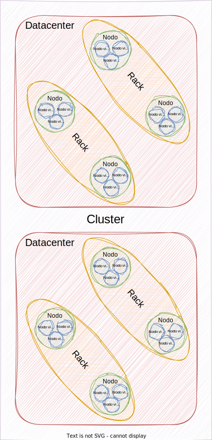
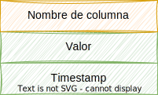
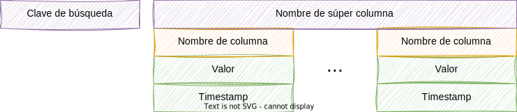
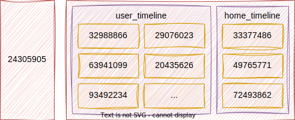
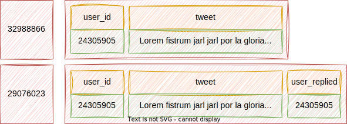
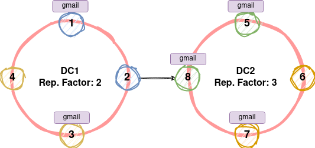

<!-- _class: titlepage -->

# Apache Cassandra - Introducción

## Bases de datos II - Curso 2023-2024

### Departamento de Sistemas Informáticos

#### E.T.S.I. de Sistemas Informáticos - UPM

##### 8 de febrero de 2024

[](https://creativecommons.org/licenses/by-nc-sa/4.0/)

---

<!-- _class: section -->

# Bases de datos clave-valor

---

# ¿Qué es una base de datos clave-valor?

Son SGBD que utilizan un modelo de datos muy simple:

- Cada registro se compone de una clave única y un valor asociado a esa clave
- Ejemplos: Redis, Riak, Amazon DynamoDB y **Apache Cassandra**

Son muy rápidas y eficientes para almacenar grandes cantidades de datos

- También permite almacenar datos estructurados y no estructurados
- Suelen ser adaptables a diferentes tipos de datos y cambios en la estructura

Nos centraremos en [Apache Cassandra](https://cassandra.apache.org/), aunque sea un modelo clave-valor híbrido

- Híbrido porque incluye el concepto de columnas
- Lakshman, A., & Malik, P. (2010). [_Cassandra: a decentralized structured storage system_](https://www.cl.cam.ac.uk/~ey204/teaching/ACS/R212_2014_2015/papers/lakshman_ladis_2009.pdf). ACM SIGOPS operating systems review, 44(2), 35-40.

---

<!-- _class: cite -->

<div class="cite-author" data-text="Cassandra: The definitive guide (J. Carpenter y E. Hewitt">

   _"Apache Cassandra is an **open source**, **distributed**, **decentralized**, **elastically scalable**, **highly available**, **fault-tolerant**, **tunable** and **consistent** database that bases its distribution design on Amazon's Dynamo and its data model on Google's Bigtable. Created at Facebook, it is now used at some of the most popular sites on the web."_

</div>

---

# Algunos datos acerca de Apache Cassandra

Sistema de gestión de bases de datos **NoSQL distribuido**

- Arrancado por Facebook y posteriormente cedido a la [Apache Foundation](https://cassandra.apache.org/)
- Gratuito y de código abierto (licenciado bajo la [Apache License 2.0](https://www.apache.org/licenses/LICENSE-2.0))
- Desarrollado en el lenguaje de programación Java y multiplataforma
- Diseñado para manejar grandes cantidades de datos entre muchos nodos
- Soporta clústeres distribuidos en diferentes clústeres
- Además con replicación asíncrona sin nodo maestro
- Esto permite operaciones de baja latencia
- Web: <https://cassandra.apache.org>
- Algunos sitios que usan Cassandra: [Netflix](https://netflixtechblog.com/tagged/cassandra), [Spotify](https://engineering.atspotify.com/tag/apache-cassandra/) y [Uber](http://highscalability.com/blog/2016/9/28/how-uber-manages-a-million-writes-per-second-using-mesos-and.html)

<!-- Libro muy bueno: Cassandra: the Definitive Guide -->

---

# Algunas de sus ventajas ...

Desarrollado directamente para ser un servidor **distribuido** y **descentralizado**

- Con soporte para distribución a lo largo de múltiples centros de datos

Lectura y escritura rápida sin afectar al servicio

Escalabilidad horizonal, permitiendo añadir nuevo hardware bajo demanda

- Alta disponibilidad sin punto único de fallo (SPOF, de _single point of failure_)
- Básicamente todo nodo del clúster conoce al resto

API simple para el acceso desde cualquier lenguaje de programación

---

# ... y de sus desventajas desventajas

Las consultas sobre el sistema son _ad hoc_

- Se modela sobre las consultas a realizar, no sobre la estructura de los datos

No soporta agregaciones como parte del modelo subyacente

- No usan el álgebra relacional, donde las agregaciones son naturales
- Esto es, las operaciones (AVG, MAX, MIN, SUM) son **MUY** costosas

Rendimiento impredecible

- Ejecuta por debajo muchos procesos asíncronos y tareas de segundo plano
- Esto se traduce en un rendimiento impredecible

---

# NO ES UN REEMPLAZO DE BASES DE DATOS RELACIONALES

Existen sitios donde se afirma esto de Apache Cassandra

- La principal causa: El lenguaje de consultas CQL

Sin embargo, no es cierto debido, principalmente, a tres factores:

1. No existe el concepto de **integridad referencia** (nada de _joins_)
1. El soporte a consultas agregadas es limitado
1. El soporte a transacciones es **muy** limitado

Al combinar con [Apache Spark](https://spark.apache.org/), se consiguen suplir los dos primeros puntos

---

# Apache Cassandra vs. bases de datos relacionales

| | Bases de datos relacionales | Cassandra |
| --- | --- | --- |
| **Lenguaje de consultas** | SQL | CQL |
| **Modelo de datos** | Relacional | Clave-valor |
| **Escalabilidad** | Vertical (aumentando hardware) | Horizontal (añadiendo nodos) |
| **Casos de uso** | Para uso general | Cargas altas de escritura |
| **Comunidad** | Extremadamente grande | Creciendo |

---

# ¿Dónde usar Apache Cassandra?

Sistemas en el que las escrituras superan a las lecturas

- Almacenamiento de todas las peticiones realizadas a un sitio web

Cuando queremos, principalmente, añadir datos y no actualizar o borrar

Cuando nuestro acceso a datos se peude resumir a consultas por clave

- Esto permite que los datos se puedan particionar según la clave
- Y así, se pueden distribuir entre los nodos de un clúster

Cuando no necesitamos hacer _joins_ o agregaciones

---

# Ejemplos

Algunos ejemplos relacionados con aplicaciones web

- Actualización de datos provenientes de múltiples sensores
- Almacenamiento de transacciones comerciales
- Autenticación de usuarios
- Estado de las transacciones, los pedidos, etc.
- Interacciones con el sitio (clicks, votaciones, etc.)
- Monitorización de logs de acceso a sistemas
- Almacenamniento de perfiles de usuarios
- Tracking de actividad de usuarios en el sitio web

---

<!-- _class: section -->

# Sobre la consistencia, disponibilidad y tolerancia a fallos

---

# Teorema de Brewer

Establece que un sistema sólo puede garantizar a la vez dos requisitos entre:

- **Consistencia**: Toda lectura recibe la escritura más reciente o un error.
- **Disponibilidad**: Toda solicitud recibe una respuesta (no error)
- **Tolerancia al particionado**: Funcionamiento a pesar de pérdida de mensajes

Conocido también como **Teorema CAP** (_**C**onsistency_, _**A**vailability_, _**P**artition tolerance_)

---

# Teorema de Brewer

<center></center>

---

# Teorema de Brewer y Cassandra

Desde un punto de vista práctico, la tolerancia a la partición es necesaria

- Los fallos en red son una constante en nuestra profesión
- Por ello las bases de datos suelen ser CP o AP

Cassandra es un sistema AP, es decir, prioriza disponibilidad sobre consistencia

- Esto es simplificar mucho, en realidad busca satisfacer los tres requisitos
- De hecho se puede configurar para que se comporte muy parecido a CP
  - Según la [Apache Software Foundation](https://www.apache.org/), ofrece una **consistencia ajustable o eventual** del orden de los milisegundos.

---

# Garantizando la disponibilidad de los datos

La disponibilidad se garantiza a través de las réplicas

- Cuando se escribe un dato, se escribe en varias réplicas
- Generalmente tres, aunque este parámetro es configurable
- Así nos aseguramos de que si cae un nodo los datos no se pierden

Las réplicas demoran la escritura

- Hay momentos en los que diferentes nodos tienen diferentes valores
- Casandra se describe como **eventualmente consistente** por esto mismo

Es decir, se garantiza la disponibilidad de los datos, pero no a su última versión

---

# Tolerancia a fallos y alta disponibilidad

Ya hemos comentado que la arquitectura de comunicación es _peer_to_peer_

- Cuando algún nodo está caído, el resto de nodos lo detectan
- Esto produce una reconfiguración de la distribución de datos
- También de las _requests_, que se redirigen a los nodos disponibles

Esto es aplicable a la escalabilidad de un clúster

- Cuando se añade un nuevo nodo, también se redistribuyen los datos
- Estos nodos reciben rangos de tokens de otros nodos
  - Así las responsabilidades se reparten de forma equitativa
- **El rendimiento escala linealmente con el número de nodos**

---

# Rendimiento en la escritura de datos

Cassandra está pensada, sobre todo, para la escritura de datos

- Su rendimiento no sólo se debe a que se lancen en paralelo a nivel de clúster
- A nivel de nodo:
  - Las escrituras se realizan en memoria (y luego se persisten en disco)
  - Todas las operaciones de escritura son secuenciales (como _appends)
  - Existe un proceso posterior de compactación que optimiza el almacenamiento

Además, no existe lectura antes de la escritura

- Otros sistemas lo suelen hacer, lo que ralentiza la escritura

---

# Cassandra Query Language (CQL)<!-- _class: section -->

---

# Cassandra Query Language (CQL)

Es el lenguaje de Cassandra para la definición y manipulación de datos

- Es un lenguaje de consulta de alto nivel, muy similar a SQL
  - Los datos se almacenan en tablas que contienen filas de valores
  - Por ello la terminología (tabla, fila y columna) es la misma en CQL

```sql
CREATE TABLE Accounts (
  Id int PRIMARY KEY,
  Username text,
  Password text
  Service text
  );

INSERT INTO Accounts (Id, Username, Password, Service)
  VALUES (1, 'user1', 'pass1', 'twitter'), (2, 'user2', 'pass2', 'gmail');

SELECT * FROM accounts WHERE Service = 'twitter';
```

---

# Algunas características

Algunas de las características más notables de CQL son:

- Tipos de datos y operadores aritméticos
- DDL y DML
- Índices secundarios
- Vistas materializadas
- Funciones y triggers

Pero cuidado, que la sintáxis similar a SQL no nos lleve a engaño:

- No es una base de datos relacional
- Las lecturas y escrituras de datos son muy diferentes, y esto afecta a la forma de escribir las consultas
  - No nos preocupemos que lo veremos más adelante

<!-- Echar un ojo a https://github.com/twissandra/twissandra/ 
Es un proyecto donde enseñan cómo funciona cassandra a partir de un proyecto similar a twitter
-->

---

<!-- _class: section -->

# Conceptos de arquitectura "física"

---

# Elementos básicos



**Nodo**: Componente básico de infraestructura

**Nodo virtual** (_vNode_): Capa de almacenamiento de datos dentro de un servidor

**_Rack_**: Agrupación lógica de nodos dentro del anillo

**Centros de datos**: Conjunto lógico de _racks_

**Clúster** (anillo): Componente que contiene uno o más centros de datos

<hr>

Jerarquía: Un **clúster** contiene uno o más **centros de datos**, que contienen uno o más **_racks_**, que contienen uno o más **nodos**, que contienen uno o más **_vNodes_**

---

# Nodo

Instancia de cassandra que se conecta con otros nodos del clúster

- Se organizan (en principio) con topología de red en anillo
- Cada nodo es independiente y tiene el mismo papel en el anillo
- Cassandra organiza los nodos en una estructura _peer-to-peer_
- Cada nodo tiene asignado un rango de tokens y contiene los datos reales de nuestra aplicación
- Cada nodo de un clúster puede aceptar peticiones de lectura y escritura
  - No importa dónde se encuentren realmente los datos en el clúster
- El término **servidor** se utiliza para referirse a una máquina con el software Cassandra instalado
  - Cada nodo tiene una única instancia de Cassandra, que técnicamente es un servidor

---

# Componentes de un nodo

Algunos de los componentes más importantes de un nodo son los siguientes:

- **Memtable**: Estructura **en memoria** donde se almacenan las escrituras
  - Suele haber una por "tabla" (es un concepto similar al relacional)
  - Eventualmente se vuelcan a disco pasando a ser SSTables
- **SSTable**: Archivo **inmutable** utilizado para la persistencia de datos en disco
  - Según se van volcando a disco, se van compactando en una sola
  - Cada una se compone de varios archivos, algunos de los cuales son:
    - `Data.db`: Los datos reales
    - `Index.db`: El índice de los datos
- **CommitLog**: Archivo de registro de los cambios en un nodo
  - Toda escritura en una Memtable pasa antes por el CommitLog

---

# Nodo virtual (_vNode_)

Es la capa de almacenamiento de datos dentro de un servidor

- Por defecto, 256 nodos virtuales por servidor
- Cada nodo virtual utiliza un subrango de tokens del nodo al que pertenece
  - Proporcionan una mayor flexibilidad al sistema
  - Cuando los tokens están desigualmente distribuidos entre nodos, se puede ampliar la capacidad de almacenamiento ampliando los nodos virtuales al nodo más cargado.

---

# _Rack_

Colección de nodos o servidores

- Se utilizan para garantizar que las réplicas se distribuyen entre diferentes agrupaciones lógicas
- No tiene por qué corresponderse con una distribución física de _racks_

¿Qué nos proporciona esta división?

Mayor tolerancia a fallos y disponibilidad, ya que las réplicas se distribuyen entre diferentes _racks_

---

# Centro de datos

Grupo de nodos relacionados dentro de un clúster

- Contiene al menos un _rack_

Al igual que los racks, se usan principalmente para propósitos de replicación, consiguiendo:

1. Reducir la latencia
2. Evitar que las transacciones se vean afectadas por otras cargas de trabajo

La replicación se puede configurar para escribir en múltiples centros de datos

---

# Clúster (anillo)

Contenedor de almacenamiento más externo de la base de datos

- Es la base de datos en sí, y se ofrece como un todo a las aplicaciones cliente

Y eso de anillo, ¿qué significa? Proviene de las versiones antiguas de Cassandra

- La topología que se formaba al levantar o tirar nodos era de anillo
- Esto es, cada nodo se comunicaba con el siguiente y el anterior

En las versiones actuales, la topología es algo más compleja

- Esto es debido a los _vNodes_
- Por ello **clúster es el término más usado en la actualidad**

Sin embargo, a efectos prácticos, la gente sigue usándolos indistintamente

---

<!-- _class: section -->

# Conceptos de arquitectura "lógica"

---

# _Keyspace_ (I)

Contenedor que almacenan los datos que usa la aplicación

- Vienen a ser análogos a los **esquemas** en el modelo relacional
- Se suele recomendar utilizar **un espacio de claves por aplicación**
  - Pero claro, sin relaciones, porque en Cassandra no existe este concepto
- Están compuestos por **tablas**, que es donde se almacenan los datos

Requieren una configuración de atributos relacionados con la consistencia:

- **Factor de replicación**: Cuánto mejorar la coherencia a costa del rendimiento
- **Estrategia de réplica**: Cómo se colocan las réplicas (`SimpleCategory`, `OldNetwork` `TopologyStrategy` y `NetworkTopologyStrategy`)

La **distribución** y **replicación** se realiza **a nivel de espacio de claves**

<!-- Mirar https://answers.oreilly.com/topic/2408-replica-placement-strategies-when-using-cassandra/ -->

---

# _Keyspace_ (y II)

```sql
CREATE KEYSPACE IF NOT EXISTS accounts_vault WITH REPLICATION = {
  'class' : 'SimpleStrategy',
  'datacenter1' : 3,
  'datacenter2' : 2
};

USE accounts_vault;
```

En realidad la sentencia `USE` no es necesaria

- Se puede especificar el espacio de claves como prefijo en las tablas
- Aún así hace más cómodod escribir las consultas

---

# Tabla

Organizan el almacenamiento de datos **a nivel de nodo y de clúster**

- Define el esquema tipado para una colección de particiones
- Contienen particiones, que contienen filas, que contienen columnas
- Pueden ser alteradas de forma flexible sin tiempo de inactividad.

En su creación hay que definir una clave primaria y otras columnas de datos

- Las **claves primarias** se componen de **una o más columnas**

```sql
CREATE TABLE IF NOT EXISTS accounts (
  id uuid,
  username text,
  password text,
  service text,
  PRIMARY KEY (id)
);
```

---

# Partición

Los **datos** de Cassandra **se almacenan en particiones**

- Cada partición es un conjunto de filas que comparten la misma **clave de partición**
  - Básicamente es un identificador único para una partición, ya lo veremos más adelante
- Las particiones se distribuyen entre los nodos de un cluster
  - Esta es la forma que tiene Cassandra de facilitar escalabilidad y tolerancia a fallos.

Cada **nodo** es responsable de un **subconjunto de particiones**

---

# Fila

Es una colección de columnas que corresponden a una clave específica

- Se identifica por una combinación única de clave de partición y clave(s) de agrupación
  - Las claves de agrupación determinan el orden de las columnas dentro de una fila y también las veremos más adelante
  - Clave de partición y claves de agrupación forman la clave primaria

Se almacenan en particiones y se distribuyen entre los nodos de un clúster

---

# Columnas

Cada tabla está compuesta por filas que contienen **columnas**

- Cada columna tiene un **nombre**, un **valor**, un **tipo de dato** y un **timestamp** asociados
- Se pueden agrupar en súpercolumnas, familias de columnas y _keyspaces_
- Son análogas a las columnas de una tabla en el modelo relacional

<center></center>

El _timestamp_ indica el momento de la última actualización de la columna

---

# Súpercolumna (_super column_)

Array ordenado de columnas

- Se compone de una clave (_row key_), un nombre y su conjunto de columnas

<center></center>

---

# Familia de columnas (_column family_) (I)

Agrupación de columnas o súper-columnas que comparten una clave común

- Conjunto de pares clave-valor donde el valor es una lista de nombres de columnas

<center></center>

Aunque gestione columnas y familias de columnas **no es una bbdd columnar**

---

# Familia de columnas (_column family_) (y II)

Familia de supercolumnas para `user_status`

<center></center>

Familia de columnas para `user_timeline`

<center></center>

---

<!-- _class: section -->

# Sistema distribuido y descentralizado

---

# Distribuido y descentralizado

Prácticamente todas las bases de datos NoSQL son distribuidas

- Ahora bien, que sean distribuidas **Y** descentralizadas no es nada común

¿Qué es cada cosa?

- **Distribuido**: Los clústers pueden funcionar en diferentes máquinas
  - Eso sí, se muestran como un único sistema al exterior
- **Descentralizado**: Todo nodo es idéntico en responsabilidades
  - Dicho de otro modo, no hay nodos primarios o secundarios.

La comunicación entre nodos se realiza mediante _peer_to_peer_ (protocolo _gossip_)

---

# ¿Cómo se distribuyen los datos? (I)

<div class="columns">
<div class="column">

| Id | Username | Password | Service  |
|----|----------|----------|----------|
| 1  | user1    | pass1    | **twitter** |
| 2  | user2    | pass2    | gmail |
| 3  | user3    | pass3    | **twitter** |
| 4  | user4    | pass4    | gmail |
| 5  | user5    | pass5    | **twitter** |
| 6  | user6    | pass6    | gmail |

</div>
<div class="column">
Tenemos un conjunto inicial de datos

- Supongamos que nuestras queries son sobre el campo _Service_
  - _¿Cuántos usuarios hay por servicio_?
- Esto requiere  agrupar los datos por la columna _Service_
  - Es decir, **particionar** por _Service_
  - `PartitionKey = Service`

</div>
</div>

---

# ¿Cómo se distribuyen los datos? (y II)

Cassandra agrupa los datos de acuerdo a las claves de partición definidas

- Tras ello, los datos se distribuyen en los nodos del clúster
- Esta operación se realiza mediante el hash de cada clave de partición
  - Se denominan _tokens_

Cada nodo tiene una lista predefinida de intervalos de _tokens_ soportados

- Los datos se dirigen al nodo adecuado en función de:
  1. El valor hash de la clave
  2. La preasignación del clúster (los intervalos de _tokens_ predefinidos)

---

# ¿Cómo se replican los datos?

Tras la asignación inicial de datos, Cassandra se encarga de replicarlos

- Esta se realiza de acuerdo al factor de réplicación (_replication factor_)
- Indica el número de nodos que mantendrán réplicas para cada partición

<hr />

<div class="columns">
<div class="column">

<center></center>

</div>
<div class="column">

Suponiendo que los nodos están distribuidos en:

- Rack 1 (1, 2), Rack 2 (3, 4), Rack 3 (5, 6), Rack 4 (7, 8)

La replicación tratará de hacerse abarcando todos los racks

</div>
</div>

---

# Gracias<!-- _class: section -->
