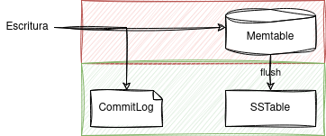
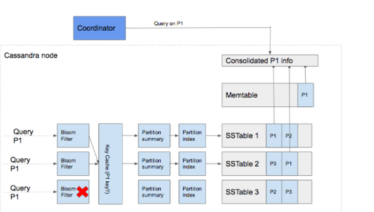

<!-- _class: titlepage -->

# Arquitectura

## Apache Cassandra - Bases de datos II

### Alberto Díaz Álvarez (<small><alberto.díaz@upm.es></small>)

#### Departamento de Sistemas Informáticos

##### Escuela Técnica superior de Ingeniería de Sistemas Informáticos

[](https://creativecommons.org/licenses/by-nc-sa/4.0/)

---

<!-- _class: intro -->

Apache Cassandra se diseñó para cumplir muchos requisitos de arquitectura:

- **Garantizar que no haya un SPF** (_Single Point of Failure_)
  - Si tenemos $N > 1$ nodos y uno falla, el clúster debe seguir funcionando
  - Otros sistemas (p.ej.  Hadoop o MongoDB) no cumplen este requisito
    - El fallo de un nodo puede causar la caída del sistema entero
- Alcanzar una **gran escalabilidad** y **elasticidad**, consiguiendo:
  1. Que un clúster pueda albergar cientos o miles de nodos
  2. Que sea posible añadir un nuevo nodo al clúster sin que éste se detenga
- Mantener una **alta disponibilidad**
  - Lo cual se aborda con una arquitectura **distribuida** y **descentralizada**

En este tema exploraremos la arquitectura de Cassandra con algo de detalle

- Así vemos cómo se implementan estos requisitos de arquitectura

---

# Arquitectura de Cassandra<!-- _class: section -->

---

# Características principales

Las principales características de la arquitectura son las siguientes:

- En Cassandra no existen jerarquías de nodos, sino que todos son iguales
- Los nodos se distribuyen siguiendo una topología de tipo anillo
- Los datos se distribuyen automáticamente entre todos los nodos
- Los _tokens_ (_hash_ de las claves) se utilizan para esta distribución
- Los datos se replican en los nodos para garantizar la redundancia
- Los datos se guardan en memoria y se persisten «perezosamente» (_lazy_)

La arquitectura soporta múltiples centros de datos

- La replicación puede realizarse a lo largo de diferentes centros de datos
- Se favorecen las lecturas en centros de datos locales frente a remotos

---

# Efectos de esta arquitectura

La ubicación de los datos en el clúster va en función de los datos

- La eficiencia es mayor ya que las consultas van a tiro hecho

Cualquier nodo puede aceptar cualquier petición

- Si un nodo tiene los datos, los devolverá
- Si no, redirigirá la petición a quien los tenga

Se puede especificar el nivel de redundancia de datos

- Se puede aumentar o disminuir en función de la criticidad de los datos

La consistencia se puede ajustar como un compromiso con el rendimiento.

---

# Operaciones de lectura/escritura<!-- _class: section -->

---

# Proceso de escritura a nivel de nodo

Cassandra procesa los datos en varias etapas durante la escritura:

1. Registro de la operación en el `CommitLog`
1. Escritura de datos en la `Memtable`
1. Descarga de datos de la `Memtable` a las `SSTables`

<center></center>

**La escritura se realiza en paralelo**, a nivel de clúster, llegando a todos los nodos que mantienen réplicas

---

# Proceso de lectura a nivel de nodo (I)

Los pasos para la lectura son los siguientes:

1. Comprobación de la `Memtable` y el [filtro de Bloom](https://en.wikipedia.org/wiki/Bloom_filter)
1. Comprobación en caché de claves de partición (si está activa)
1. Si la partición no está en la caché, se comprueba el (_summary_) de la partición
1. Se accede al índice de la partición
1. Se localizan los datos en el disco
1. Se obtienen los datos de la `SSTable`
1. Antes de devolverlos, consolidación a partir de la `Memtable` y la `SSTable`

Vamos, que es un proceso algo largo y tedioso

---

# Proceso de lectura a nivel de nodo (y II)

La lectura en Apache Cassandra es más compleja que la escritura

<center></center><!-- TODO: Rehacer este dibujo -->

---

# Particionado de datos<!-- _class: section -->

---

# Inspiración

Cassandra se apoya en una serie de técnicas de DynamoDB

- El sistema de almacenamiento distribuido clave-valor de Amazon

En este sistema cada nodo tiene tres componentes principales:

1. Coordinación de peticiones sobre un conjunto de datos **particionado**
1. Pertenencia a un **anillo** y detección de fallos
1. Un motor de **persistencia local**

Cassandra se basa principalmente en los dos primeros

- El motor de persistencia se basa en un [_Log Structured Merge Tree_ (LSM)](https://en.wikipedia.org/wiki/Log-structured_merge-tree)

El diseño de Cassandra trata de satisfacer requisitos de almacenamiento del orden de PiB+ de datos, con baja latencia lectura y escritura

---

# Particionado de datos (I)

La escalabilidad horizontal se logra en mediante la partición de los datos

- Esta se realiza mediante una función hash aplicada a su clave de particionado

Cada partición se replica en múltiples nodos físicos

- Pero cada nodo puede aceptar independientemente actualizaciones para cada clave que posee
- Como cada réplica puede aceptar mutaciones de manera independiente para cada clave que posee, cada clave debe ser versionada.
- El método de consolidación de datos es el de "la última escritura gana", donde cada mutación se marca con una marca de tiempo y la última versión de los datos es la que tiene valor

---

# Particionado de datos (II)

El particionado de datos en Cassandra se realiza mediante [_consistent hashing_](https://en.wikipedia.org/wiki/Consistent_hashing)

- Es un tipo especial de hashing que permite que la reasignacion de claves al cambiar la tabla hash es menor que en el hashing tradicional

El funcionamiento (muy similar al [algoritmo Chord](https://es.wikipedia.org/wiki/Chord)) es el siguiente:

- Cassandra asigna cada nodo a uno o más _tokens_ en un anillo de hash continuo
- Luego define la pertenencia mediante el hash de una clave en el anillo
- Por último, recorre el anillo en una dirección (sentido horario) para alcanzar los _tokens_ requeridos

---

# Replicación de datos<!-- _class: section -->

---

# Replicación de datos

Cada partición de datos se replica en múltiples nodos del cluster

- En cada mutación, el **nodo coordinador** determina el **nodo a modificar**
- Luego replica dicha mutación a los **nodos réplica** de esos datos
- El modo en que se realiza se denomina **estrategia de Replicación**

Toda estrategia de replicación tiene la noción de factor de replicación (RF)

- Indica cuántas copias de la partición deben existir en el cluster

Los nodos réplica se eligen siempre entre nodos físicos distintos

- Se consigue saltándose nodos virtuales si es necesario
- Cada estrategia de replicación es diferente y se define por _keyspace_

---

# Estrategias

**`NetworkTopologyStrategy`**: Permite definir el RF por _datacenter_

- También intenta elegir réplicas dentro de un _datacenter_ de diferentes racks
  - Si número de racks $\ge$ RF, cada réplica caerá en un rack diferente
  - Si no, cada _rack_ contendrá al menos una réplica, y algunos más de una

**`SimpleStrategy`**: Permite definir el RF por clúster

- Trata todos los nodos igual, ignorando configuración de _rack_ o _datacenter_

`NetworkTopologyStrategy` se suele preferir sobre `SimpleStrategy`

- Incluso si se usa un único _datacenter_
- Esto es debido a que facilita el añadir nuevos _datacenters_ en el futuro

---

# Operaciones de lectura/escritura<!-- _class: section -->

---

# Proceso de escritura a nivel de nodo

Cassandra procesa los datos en varias etapas durante la escritura:

1. Registro de la operación en el `CommitLog`
1. Escritura de datos en la `Memtable`
1. Descarga de datos de la `Memtable` a las `SSTables`

<center></center>

**La escritura se realiza en paralelo**, a nivel de clúster, llegando a todos los nodos que mantienen réplicas

---

# Proceso de lectura a nivel de nodo

La lectura en Apache Cassandra es más compleja que la escritura

<center></center><!-- TODO: Rehacer este dibujo -->

---

# Proceso de escritura a nivel de nodo (II)

- Los datos en disco pueden estar fragmentados en varias SSTables
- Necesita consolidar los datos existentes en Memtables y SSTables
- La lectura necesita identificar la SSTable que más probablemente contenga información sobre las particiones que estamos consultando
- Esta selección se realiza mediante la información del `BloomFilter`.

---

# Proceso de escritura a nivel de nodo (y III)

Los pasos para la lectura son los siguientes:

1. Comprobación de la `Memtable`
1. Comprobación del `BloomFilter`
1. Comprobación en caché de claves de partición (si está activa)
1. Si la partición no está en la caché, se comprueba el resumen (_summary_) de la partición
1. Se accede al índice de la partición
1. Se localizan los datos en el disco
1. Se obtienen los datos de la `SSTable`
1. Antes de devolverlos, los datos se consolidan a partir de la `Memtable` y la `SSTable`

Vamos, que es un proceso algo largo y tedioso

---

# Consistencia de datos ajustable<!-- _class: section -->

---

# Niveles de consistencia (I)

Valores por los que se configura el comprimso consistencia-disponibilidad

- En Cassandra se ofrece un conjunto fijo de niveles de consistencia
  - Esto permite elegir el comportamiento sin conocer el factor de replicación
  - Otros motores, como DynamoDB, requieren valores absolutos de nodos

Las escrituras se consolidan cuando llegan al número de nodos especificados por el nivel de consistencia.

- `ONE`, `TWO` y `THREE`: Al menos una, dos y tres réplicas, respectivamente
- `QUORUM`: La mayoría (concretamente $n/2 + 1$) de réplicas del clúster
- `ALL`: Todas las réplicas
- `LOCAL_*`: Limita la respuesta a las réplicas del datacenter local
- `ANY`: No requiere respuesta de ningún nodo (sólo escritura)

---

# Niveles de consistencia (y II)

Las operaciones de **escritura** se envían siempre a **todas las réplicas**

- Esto es independiente del nivel de consistencia que sólo controla cuántas respuestas espera el coordinador antes de responder al cliente

Las de **lectura** sólo se envían a las **réplicas necesarias** para satisfacer el nivel de consistencia

- Excepción: Petición de **lectura redundante** a una réplica extra **si** las **originales no han respondido** dentro de una ventana de tiempo especificada

---

# _Snitch_<!-- _class: section -->

---

# ¿Chivato?

El _snitch_ es un componente con dos funciones principales:

1. Le especifica a cassandra la topology del clúster para enrutar las soluciones de la manera más eficiente
1. Permite la distribución de las réplicas por el clúster para evitar fallos correlacionados

Para este último punto, agrupa las máquinas en _datacenters_ y _racks_

- Cassandra hará todo lo posible para no tener más de una réplica en el mismo _rack_

---

# _Gossip Protocol_<!-- _class: section -->

---

# Comunicación y detección de fallos

Tanto la réplica como el particionado dependen de saber el estado de los nodos

- Es la única forma de que lecturas y escrituras sean dirigidas de forma óptima

Cassandra utiliza un mecanismo de comunicación denominado _gossip_  (cotilleo)

- Es la forma en que Cassandra propaga la información entre los nodos
- Éstos intercambian información de su estado y del de los nodos que conocen
- Esta información se versiona con un [_vector clock_](https://en.wikipedia.org/wiki/Vector_clock) de tuplas $(G, V)$ donde:
  - $G$ (generación): Es una _timestamp_ monótono
  - $V$ (versión): Reloj lógico de frecuencia aproximada de 1 Hz
- Estos relojes permiten ignorar mensajes antiguos

---

# Protocolo _gossip_

Cada segundo, de forma independiente se ejecuta el siguiente proceso:

1. Actualización del estado del nodo local
2. Elección al azar de otro nodo del clúster con el que intercambiar el estado
3. Intentar "cotillear" con cualquier nodo inalcanzable (si existe)
4. "Cotillear" con un nodo semilla (si no ha pasado ya en el paso 2)

Al arrancar un cluster se designan ciertos nodos como nodos semilla:

- Se diferencian en que pueden arrancarse sin ver a otros nodos semilla
- Se convierten en "puntos calientes" para el cotilleo" debido al paso 4 anterior

Es habitual tener varios nodos para que los nodos no semilla entren en el clúster

- Generalmente se incluye uno por cada _rack_ o _datacenter_

---

# Clasves de partición y de _clustering_<!-- _class: section -->

---

# Sobre la clave primaria (I)

Es un subconjunto de las columnas de la tabla

No sólo es obligatoria, sino que además es **no puede cambiar una vez creada**

Tiene dos roles fundamentales:

- Optimizar el rendimiento en las consultas de lectura
  - _Query driven table design_, esto es, las tablas se definen **después** de saber qué consultas queremos hacer (como en casi todos los SGBD NoSQL)
  - La clave primaria se define **según de las consultas que se van a realizar**
- Identificar de forma única cada fila

---

# Sobre la clave primaria (y II)

La clave primaria se compone de:

- Una _Partition Key_: Obligatoria, y compuesta de una o más columnas
- Una o más _Clustering Keys_: Opcionales
  ```sql
    ...
    PRIMARY KEY ((id),  service)
    ...
  ```
- En este ejemplo concreto, `id` sería la _Partition Key_ y `service` la _Clustering Key_

De acuerdo a esto, se definen dos tipos de tablas:

- Tablas **estáticas**: Aquellas que definen sólo la clave de partición
- Tablas **dinámicas**: Aquellas que definen también la clave de clúster.

---

# Claves de partición (_Partition Keys_)

Cuando se escriben los datos en una tabla, estos se agrupan en **particiones** y se distribuyen en nodos

- Esta operación se basa en la clave de partición (_Partition Key_)
- Al resumen hash de una partición se le denomina _token_
- Cada nodo tiene un rango de tokens, por lo que la clave de partición determina la localidad de los datos (partición) en el clúster

Las particiones son unidades fundamentales en Cassandra

- Cada partición podrá ser encontrada siempre en al menos un nodo
  - Bueno, y también en sus réplicas

Cuando nuestro clúster se compone de cientos de miles de nodos, la clave para mejorar el rendimiento es limitar el número de consultas entre nodos

---

# Claves de clústering (_Clustering Keys_)

Almacena los datos en orden ascendente (defecto) o descendente en la partición

- Ascendente por defecto

```sql
CREATE TABLE IF NOT EXISTS accounts (
  id uuid,
  username text,
  password text,
  service text,
  PRIMARY KEY ((service),  username)
);
```

En este ejemplo los datos se ordenarán por `service` dentro de cada partición

- Esto optimiza la recuperación de valores cercanos en una misma partición
- Más de una clave de clúster implica órden múltiple

---

# Gracias<!-- _class: section -->
