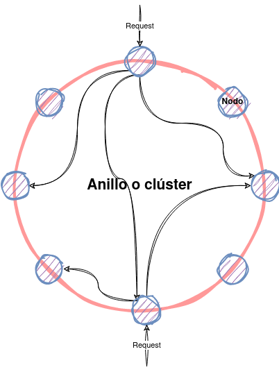

<!-- _class: titlepage -->

# Arquitectura

## Apache Cassandra - Bases de datos II

### Alberto Díaz Álvarez (<small><alberto.díaz@upm.es></small>)

#### Departamento de Sistemas Informáticos

##### Escuela Técnica superior de Ingeniería de Sistemas Informáticos

---

# Un poquito de arquitectura<!-- _class: section -->

---

# Topología de Apache Cassandra

Arquitecura de sistema distribuido

- Aun así, puede instalarse en una única máquina (o contenedor)

**Nodo**: Una instancia de Cassandra

- Entidad más pequeña de un **clúster**
- La escalabilidad horizontal surge de añadir más nodos al clúster
- Todos tienen la misma jerarquía
- Contienen una réplicas para diferentes rangos de datos

---

# Comunicación entre nodos

Cassandra utiliza un mecanismo de comunicación denominado _gossip_  (cotilleo)

- Comunicación interna para permitir la comunicación dentro de un clúster
- Informa a cada nodo del estado del resto (hasta tres nodos por segundo)
- De esta manera, cada nodo conoce a otros nodos
- Este protocolo ayuda a la descentralización y a la tolerancia a fallo

Los mensajes tienen un formatos específico que incluye un número de versión

- La comunicación es muy eficiente
- Permite que cada nodo construya rápidamente una visión general del clúster
  - Nodos caídos, qué tokens se asignan a cada nodo, etcétera

---

# Componentes de un nodo (I)

Algunos de los componentes más importantes de un nodo son los siguientes:

- **Memtable**: Estructura **en memoria** donde se almacenan las escrituras
  - Suele haber una por "tabla" (es un concepto similar al relacional)
  - Eventualmente se vuelcan a disco pasando a ser SSTables
- **SSTable**: Archivo **inmutable** utilizado para la persistencia de datos en disco
  - Según se van volcando a disco, se van compactando en una sola
  - Cada una se compone de varios archivos, algunos de los cuales son:
    - `Data.db`: Los datos reales
    - `Index.db`: El índice de los datos
- **CommitLog**: Archivo de registro de los cambios en un nodo
  - Toda escritura en una Memtable pasa antes por el CommitLog

---

# Más allá del despliegue local

Un clúster de Cassandra puede ser un despliegue en un mismo centro de datos

- En una máquina o en varias máquinas repartidas a lo largo de la misma red

Sin embargo, soporta el despliegue en múltiples centros de datos

- A efectos del sistema cliente, siempre se ve una única instancia de Cassandra
- Internamente, Cassandra se encarga de la replicación de datos entre CDC
- Y de la comunicación entre nodos, independientemente de su localización

---

# Modelo de datos<!-- _class: section -->

---

# Replicación de datos<!-- _class: section -->

---

# Operaciones de lectura/escritura<!-- _class: section -->

---

# Proceso de escritura a nivel de nodo

Cassandra procesa los datos en varias etapas durante la escritura:

1. Registro de la operación en el `CommitLog`
1. Escritura de datos en la `Memtable`
1. Descarga de datos de la `Memtable` a las `SSTables`

**La escritura se realiza en paralelo**, a nivel de clúster, llegando a todos los nodos que mantienen réplicas

---

# Proceso de lectura a nivel de nodo

La lectura en Apache Cassandra es más compleja que la escritura

<!-- TODO: Rehacer este dibujo -->

---

# Proceso de escritura a nivel de nodo (II)

- Los datos en disco pueden estar fragmentados en varias SSTables
- Necesita consolidar los datos existentes en Memtables y SSTables
- La lectura necesita identificar la SSTable que más probablemente contenga información sobre las particiones que estamos consultando
- Esta selección se realiza mediante la información del `BloomFilter`.

---

# Proceso de escritura a nivel de nodo (y III)

Los pasos para la lectura son los siguientes:

1. Comprobación de la `Memtable`
1. Comprobación del `BloomFilter`
1. Comprobación en caché de claves de partición (si está activa)
1. Si la partición no está en la caché, se comprueba el resumen (*summary*) de la partición
1. Se accede al índice de la partición
1. Se localizan los datos en el disco
1. Se obtienen los datos de la `SSTable`
1. Antes de devolverlos, los datos se consolidan a partir de la `Memtable` y la `SSTable`

Vamos, que es un proceso algo largo y tedioso

---

# Compresión de datos<!-- _class: section -->

---

# Consistencia de datos ajustable<!-- _class: section -->

---

# _Gossip Protocol_<!-- _class: section -->

---

# Detección de fallos<!-- _class: section -->

---

# HintedHandoffs<!-- _class: section -->

---

# Filtros de Bloom<!-- _class: section -->

---

# Gracias<!-- _class: section -->
