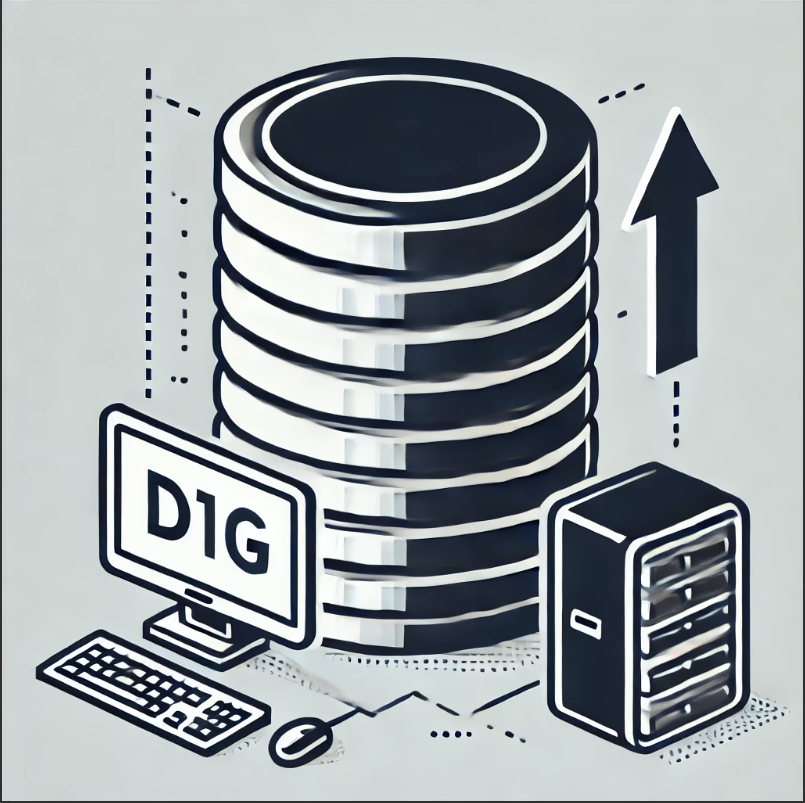
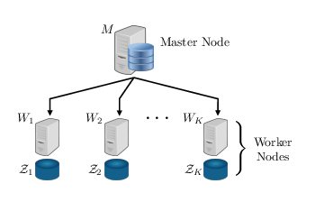
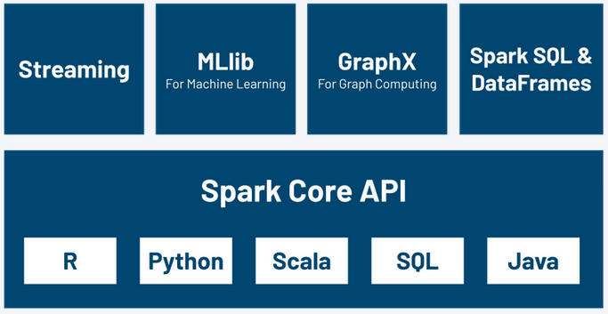
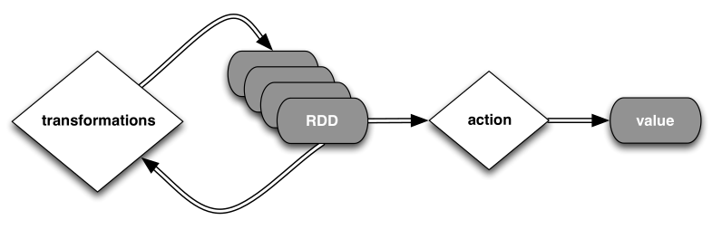
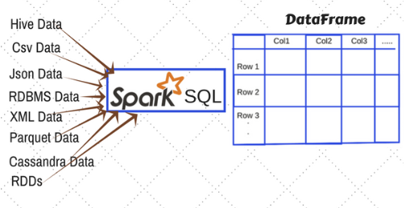
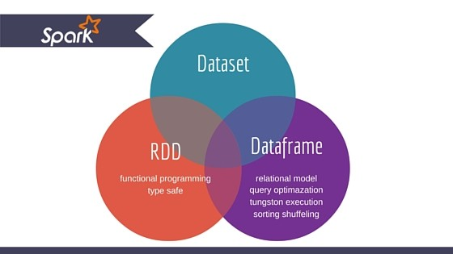

<!-- _class: titlepage -->

# Apache Spark

## Bases de datos II

### Guillermo Sánchez (<small><guillermo.sanchezg@upm.es></small>)

#### Departamento de Sistemas Informáticos

##### Escuela Técnica superior de Ingeniería de Sistemas Informáticos

[](https://creativecommons.org/licenses/by-nc-sa/4.0/)

---

<!-- _class: intro -->

# Introducción a Apache Spark

---

# Contenidos

- ¿Qué es Apache Spark?
  - MapReduce: ¿Qué es?
  - Ecosistema Spark
- Fundamentos Técnicos: RDDs
  - transformaciones y acciones
  - Resilencia en Spark
  - Persistencia en Spark
  - Spark extra: Variables compartidas
- La API de Spark
- DataFrames

---

<!-- _class: section -->

# ¿Qué es Apache Spark?
---

# ¿Qué es Apache Spark?

- **Framework de procesamiento distribuido en memoria**: Apache Spark es un motor de procesamiento de datos de código abierto diseñado para realizar análisis de datos a gran escala de manera rápida y eficiente.
- **Alternativa optimizada a Hadoop MapReduce**: A diferencia de Hadoop MapReduce, que escribe datos en disco después de cada operación, Spark realiza el procesamiento en memoria, lo que reduce significativamente los tiempos de latencia.
- **Compatible con múltiples lenguajes**: Spark ofrece APIs en Scala, Python, Java y R, lo que facilita su adopción por parte de desarrolladores con diferentes backgrounds.

---

## MapReduce: ¿Qué es?

### Motivación

- **Crecimiento exponencial de datos**: En la era del Big Data, la cantidad de datos generados y recopilados está creciendo a un ritmo sin precedentes.

<center></center>

---

## MapReduce: ¿Qué es?

### Motivación

- **Limitaciones de hardware**: Los datasets no caben en la memoria RAM de una sola máquina, lo que hace necesario distribuir el procesamiento.

<center></center>

---

## MapReduce: ¿Qué es?

### Motivación

- **Procesamiento intensivo**: Operaciones sobre grandes volúmenes de datos son costosas en términos de tiempo y recursos, requiriendo soluciones eficientes.

<center></center>

---

## MapReduce: ¿Qué es?

### Computación Distribuida

- **Necesidad de distribuir el procesamiento**: Para manejar grandes volúmenes de datos, es necesario distribuir las tareas entre múltiples nodos.

<center></center>

<small>Fuente: Elmahdy, Adel & Mohajer, Soheil. (2018). On the Fundamental Limits of Coded Data Shuffling. 716-720. 10.1109/ISIT.2018.8437672.</small>

---
## MapReduce: ¿Qué es?

### Computación Distribuida

- **Complejidad de implementación**
- **Costos asociados**

<center></center>

<small>Fuente: Elmahdy, Adel & Mohajer, Soheil. (2018). On the Fundamental Limits of Coded Data Shuffling. 716-720. 10.1109/ISIT.2018.8437672.</small>

---
## MapReduce: ¿Qué es?

- **La computación distribuida es muy difícil de implementar**.
- **El paradigma MapReduce proporciona una abstracción**: Permite realizar computación distribuida sin enfrentar estas dificultades, simplificando el desarrollo y la ejecución de tareas distribuidas. (Desarrollado e Implementado por Hadoop)

<center></center>

---

## Paradigma MapReduce

- **MapReduce**: Es un modelo de programación para el procesamiento de grandes volúmenes de datos de manera distribuida.
- **Fases principales**:
  - **Map**: Divide el problema en subproblemas más pequeños y los distribuye a diferentes nodos para su procesamiento.
  - **Reduce**: Combina los resultados de los subproblemas para obtener la solución final.

---

## Paradigma MapReduce


- **Ventajas**:
  - **Escalabilidad**: Permite el procesamiento de datos distribuidos en nodos.
  - **Tolerancia a fallos**: Los datos se replican y las tareas fallidas se reejecutan automáticamente.
- **Desventajas**:
  - **Latencia**: La **escritura en disco** después de cada operación puede ser lenta.
  - **Complejidad**: Requiere una implementación cuidadosa para manejar la distribución y la tolerancia a fallos.

---

## Conceptos: map y reduce

- **map** ejecuta la función lambda en cada elemento de la lista dada.
  ```python
  >>> list(map(lambda x: x*2, [1, 2, 3]))
  [2, 4, 6]
  ```
- **reduce** ejecuta la función lambda de manera jerárquica en cada par.
  ```python
  >>> from functools import reduce
  >>> reduce(lambda x, y: x + y, map(lambda x: x * 2, [1, 2, 3]))
  12
  ```
---

## MapReduce ejemplo

- **Shuffle**: Concepto extra, distribución de datos agrupados por la _key_ 

<center></center>

<small>Fuente: [Today Software Magazine](https://www.todaysoftmag.com/images/articles/tsm33/large/a11.png)</small>

---
## Spark

**Definición**: Framework de proceesamiento de datos que puede realizar rápidamente tareas sobre conjuntos de **datos masivos** y distribuir el procesamiento de datos eficientemente. Utiliza almacenamiento en **caché** y la ejecución de consultas es optimizada para datos de cualquier tamaño. En pocas palabras, Spark es un motor rápido y general para el procesamiento de datos a gran escala.
<center></center>


---
## Spark

- **Procesamiento mucho más eficiente y tolerancia a fallos**: Basado en **Resilient Distributed Datasets** (RDDs).
- **Mantiene los datos en memoria principal**: Esto permite un acceso rápido y eficiente a los datos.
- **API flexible**: Ofrece una API versátil que soporta múltiples lenguajes de programación.
- **Memoria distribuida**: Los datos se distribuyen en la memoria de múltiples nodos, mejorando la escalabilidad y el rendimiento.

---
## Ecosistema Spark

- **Spark Core**: Es el núcleo del framework que proporciona funcionalidades básicas de I/O, planificación y gestión de tareas distribuidas.
- **Spark SQL**: Módulo que permite realizar consultas estructuradas utilizando SQL sobre datos distribuidos.
- **Spark Streaming**: Extensión que facilita el procesamiento de datos en tiempo real, permitiendo la ingestión y análisis de flujos de datos en mini-lotes.
- **MLlib**: Biblioteca de aprendizaje automático que ofrece algoritmos y utilidades para machine learning en entornos distribuidos.
- **GraphX**: API para el procesamiento y análisis de grafos distribuidos, permitiendo operaciones complejas sobre estructuras de datos en forma de grafo.
---

## Ecosistema Spark

<center></center>

<small>Fuente: Núñez, Alejandro & Flores, Jorge. (2021). High-availability distributed architecture for fraud detection. 15. 199-224. </small>

---
## Ecosistema Spark
- **Scala vs. Python**: Spark está escrito en Scala. Scala no solo es el lenguaje de programación de Spark, sino que también es escalable en JVM.
- **UDFs**: User-Defined Functions(UDFs) son rutinas programables por el usuario que actúan sobre una fila.

<center></center>

<small><center>Fuente: [Scala Vs. Python](https://www.simplilearn.com/scala-vs-python-article)</center></small>

---
## Ecosistema Spark
- **Scala vs. Python usando UDFs**: transformacines de un DataFrame con funciones nativas o SQL, ocurren dentro de la JVM. Sin embargo, al usar UDFs de Python, el código no se ejecuta  Python Runtime. Cada fila del DataFrame se serializa, se envía al Python Runtime y se devuelve a la JVM. 

<center></center>

<small><center>Fuente: [Evitando usar UDFs en Apache Spark](https://blog.damavis.com/evitando-usar-udfs-en-apache-spark/)</center></small>

---
## Ecosistema Spark
- **Scala vs. Python**: Scala es diez veces más rápido que Python. 
- **Concurrencia**: Scala maneja muy bien la concurrencia y el paralelismo, mientras que Python no soporta el multihilo verdadero.
- **Curva de aprendizaje**: Scala es más complejo en comparación con Python.
- **Soporte de la comunidad**: Python tiene una comunidad muy grande de la cual puede obtener soporte.
- **Uso de IA**: El ecosistema de Python es un recurso ideal para el aprendizaje automático y la inteligencia artificial (IA).
---
## Ecosistema Spark
- **Scala vs. Python** Elección:
  - Proyectos grandes y Scalables: Scala. 
  - Presupuesto: Profesionales con Scala mucho más caros.
  - IA: cuanta más orientación a IA mejor python
  - Mejor comunicacón con el equipo: Python
  - En este curso: Python
---

<!-- _class: section -->

# Fundamentos Técnicos: RDDs

---

# Fundamentos Técnicos: RDDs

  > “Formally, an RDD is a read-only, partitioned collection of records. RDDs can only be created through deterministic operations on (1) data in stable storage or (2) other RDDs.”
    
  <small>Zaharia, Matei, et al. "Resilient distributed datasets: A fault-tolerant abstraction for in-memory cluster computing." Proceedings of the 9th USENIX conference on Networked Systems Design and Implementation. USENIX Association, 2012.</small>

---

# Fundamentos Técnicos: RDDs


  Un RDD es básicamente una colección distribuida de elementos.
  Propiedades clave:
  - Puede ser manipulado mediante transformaciones y acciones.
  - Resiliencia
  - Persistencia

---
# RDDs

- **Transformaciones**:
  - **map**, **filter**, **join**, etc.
  - Producen un nuevo RDD.
  - Evaluación perezosa: no se ejecutan hasta que se realiza una acción.


  <center></center>

---
# RDDs

- **Acciones**:
  - **reduce**, **collect**, **count**, etc.
  - Producen un resultado.
  - Desencadenan la ejecución de las transformaciones.

  <center></center>

---

# Transformaciones en Spark

| Transformación | Descripción |
|----------------|-------------|
| **groupByKey([numTasks])** | Agrupa los valores por clave. |
| **reduceByKey(func, [numTasks])** | Agrega los valores por clave usando una función de reducción. |
| **sortByKey([ascending], [numTasks])** | Ordena los pares por clave en orden ascendente o descendente. |


---

# Transformaciones en Spark

| Transformación | Descripción |
|----------------|-------------|
| **join(otherDataset, [numTasks])** | Une dos conjuntos de datos por clave, devolviendo pares de elementos. |
| **cogroup(otherDataset, [numTasks])** | Agrupa dos conjuntos de datos por clave, devolviendo tuplas de secuencias. |
| **cartesian(otherDataset)** | Devuelve el producto cartesiano de dos conjuntos de datos. |

---

# Acciones en Spark

| Acción | Descripción |
|--------|-------------|
| **reduce(func)** | Agrega los elementos del dataset usando una función que toma dos argumentos y devuelve uno. Debe ser conmutativa y asociativa para ser computada correctamente en paralelo. |
| **collect()** | Devuelve todos los elementos del dataset como un array en el programa driver, útil después de un filtro u otra operación que devuelve un subconjunto pequeño de datos. |
---

# Acciones en Spark

| Acción | Descripción |
|--------|-------------|
| **count()** | Devuelve el número de elementos en el dataset. |
| **first()** | Devuelve el primer elemento del dataset, similar a `take(1)`. |
| **take(n)** | Devuelve un array con los primeros n elementos del dataset. No se ejecuta en paralelo; el programa driver computa todos los elementos. |

---
# Acciones en Spark

| Acción | Descripción |
|--------|-------------|
| **takeSample(withReplacement, fraction, seed)** | Devuelve un array con una muestra aleatoria de num elementos del dataset, con o sin reemplazo, usando la semilla del generador de números aleatorios dada. |
| **saveAsTextFile(path)** | Guarda los elementos del dataset como archivos de texto en un directorio especificado, compatible con sistemas de archivos como HDFS. Cada elemento se convierte en una línea de texto. |

---

# Acciones en Spark

| Acción | Descripción |
|--------|-------------|
| **saveAsSequenceFile(path)** | Escribe los elementos del dataset como un archivo de secuencia de Hadoop en una ruta dada en el sistema de archivos local, HDFS o cualquier otro sistema de archivos compatible con Hadoop. Solo disponible en RDDs de pares clave-valor que implementan la interfaz Writable de Hadoop o son convertibles implícitamente a Writable (Spark incluye conversiones para tipos básicos como Int, Double, String, etc.). |

---

# Acciones en Spark

| Acción | Descripción |
|--------|-------------|
| **countByKey()** | Solo disponible en RDDs de tipo (K, V). Devuelve un `Map` de pares (K, Int) con el conteo de cada clave. |
| **foreach(func)** | Ejecuta una función `func` en cada elemento del dataset, generalmente utilizada para efectos secundarios como actualizar una variable acumuladora o interactuar con sistemas de almacenamiento externos. |

---

# RDDs
## Resiliencia: Linaje
Spark no ejecuta las transformaciones inmediatamente.
En su lugar, construye un plan de ejecución conocido como linaje.

Ejemplo de encadenamiento:

```markdown
- someRDD → map(f) → filter(g) → join(otherRDD)
```
Cada transformación genera un nuevo RDD, pero no se computa aún.

---

# RDDs
## Resiliencia: Linaje

Estas transformaciones se almacenan como una secuencia de pasos:

- Spark recuerda cómo generar cada RDD a partir del anterior.
- Solo ejecuta esta secuencia cuando se invoca una acción (collect(), count(), etc.).

Ventaja clave:
- Si un nodo falla, Spark reconstruye los datos perdidos aplicando de nuevo solo las transformaciones necesarias.

---
# RDDs
## Persistencia

- Por defecto, Spark no guarda los RDDs en memoria.
- Cada acción recorre el linaje completo.
- Con cache() o persist(), Spark almacena el RDD en memoria.Si se vuelve a usar, no se recalcula: se reutiliza.
- **Ventaja**: Mejora el rendimiento cuando un RDD se usa varias veces. Solo se guarda tras ejecutarlo por primera vez.

---
# RDDs
## Persistencia

- **Transformaciones perezosas (lazy evaluation)**: Las operaciones en RDDs no se ejecutan inmediatamente; Spark construye un plan de ejecución que se materializa solo cuando es necesario, optimizando el rendimiento.
- **Tipos de operaciones**:
  - **Transformations**: Operaciones que producen nuevos RDDs a partir de existentes, como map, filter o groupBy.
  - **Actions**: Operaciones que devuelven un valor al driver o almacenan datos externamente, como collect, count o reduce.
- **Ventajas**: Al mantener los datos en memoria y ser inmutables, los RDDs evitan escrituras intermedias en disco y facilitan la recuperación en caso de fallos.

---
# Spark extra: Variables compartidas
## Tipo Broadcast

Las variables tipo Broadcast permiten al programador mantener una variable de solo lectura en caché en cada máquina en lugar de enviar una copia de la misma con cada tarea.

Por ejemplo, para proporcionar a cada nodo una copia de un gran conjunto de datos de entrada de manera eficiente.

Spark también intenta distribuir las variables tipo Broadcast utilizando algoritmos de difusión eficientes para reducir el costo de comunicación.

```python
broadcastVar = sc.broadcast(list(range(1, 4)))
broadcastVar.value
```

---

# Spark extra: Variables compartidas
## Acumuladores

Los acumuladores son variables que solo pueden ser "sumadas" a través de una operación asociativa.

Se utilizan para implementar contadores y sumas de manera eficiente en paralelo.

Spark soporta nativamente acumuladores de tipos de valor numérico y colecciones mutables estándar, y los programadores pueden extenderlos para nuevos tipos.

---

# Spark extra: Variables compartidas
## Acumuladores


Solo el programa driver puede leer el valor de un acumulador, no las tareas.

```python
accum = sc.accumulator(0)
rdd = sc.parallelize([1, 2, 3, 4])

def f(x):
  global accum
  accum += x

rdd.foreach(f)

accum.value
```

---

<!-- _class: section -->

# Spark API

---
# Spark: API

- SparkContext: Interfaz principal de Spark. Permite crear RDDs y variables compartidas:

```python
from pyspark import SparkConf, SparkContext

conf = SparkConf().setAppName("MiAplicacion").setMaster("local")
sc = SparkContext(conf=conf)
```## Ecosistema Spark
- **Scala vs. Python usando UDFs**: transformacines de un DataFrame con funciones nativas o SQL, ocurren dentro de la JVM.. Sin embargo, al usar UDFs de Python, el código no se ejecuta  Python Runtime. Cada fila del DataFrame se serializa, se envía al Python Runtime y se devuelve a la JVM. 

<center></center>

- Crear un RDD desde una lista:

```python
rdd = sc.parallelize(range(10))
```

- Crear un RDD desde un archivo de texto: 

```python
rdd = sc.textFile("ruta/al/archivo.txt")
```

---
# Spark API
```python
rdd = sc.parallelize(range(1, 5))
result = rdd.map(lambda x: x + 1).reduce(lambda x, y: x + y)
print(result)
```
Output: ¿?

---
# Spark API
```python
rdd = sc.parallelize(range(1, 5))
result = rdd.map(lambda x: x + 1).reduce(lambda x, y: x + y)
print(result)
```
Output: `14`

---
# Spark API
flatMap: Devuelve un iterable aplanado.
```python
rdd = sc.parallelize(range(1, 4))
rdd.flatMap(lambda x: range(x)).reduce(lambda x, y: x + y)
```
Output: `¿?`

--- 
# Spark API
flatMap: Devuelve un iterable aplanado.
```python
rdd = sc.parallelize(range(1, 4))
rdd.flatMap(lambda x: range(x)).reduce(lambda x, y: x + y)
```
Output: `4`

---
# Spark API
groupByKey
```python
rdd = sc.parallelize([('odd', 1), ('odd', 3), ('even', 2), ('even', 4)])
rdd.groupByKey().collect()
```
Output: `¿?`

Las listas son en realidad de tipo `ResultIterable`, pero se pueden convertir a una lista de Python.

---
# Spark API
groupByKey
```python
rdd = sc.parallelize([('odd', 1), ('odd', 3), ('even', 2), ('even', 4)])
rdd.groupByKey().mapValues(list).collect()
```
Output: `[('odd', [1, 3]), ('even', [2, 4])]`

---
# Spark API
reduceByKey
```python
rdd = sc.parallelize([('odd', 1), ('odd', 3), ('even', 2), ('even', 4)])
rdd.reduceByKey(lambda x, y: x + y).collect()
```
Output: `¿?`

---

# Spark API
reduceByKey
```python
rdd = sc.parallelize([('odd', 1), ('odd', 3), ('even', 2), ('even', 4)])
rdd.reduceByKey(lambda x, y: x + y).collect()
```
Output: `[('even', 6), ('odd', 4)]`

---
# Spark API
## aggregateByKey

```python
rdd = sc.parallelize([(1,1),(1,3),(2,2),(2,4),(2,6)])
rdd.glom().collect()
```
Output: `[[ (1, 1) ], [ (1, 3) ], [ (2, 2) ], [ (2, 4), (2, 6) ]]`

```python
rdd.aggregateByKey([], lambda x, y: x + [y], lambda x, y: x + y).collect()
```
Output: `¿?`

- El primer parámetro es de tipo U. Generalmente neutral.
- Primera función: `f : (U, T) → U`. Agregación por partición.
- Segunda función: `g : (U, U) → U`. Agregación de particiones.
---
# Spark API
## aggregateByKey

```python
rdd = sc.parallelize([(1,1),(1,3),(2,2),(2,4),(2,6)])
rdd.glom().collect()
```
Output: `[[ (1, 1) ], [ (1, 3) ], [ (2, 2) ], [ (2, 4), (2, 6) ]]`

```python
rdd.aggregateByKey([], lambda x, y: x + [y], lambda x, y: x + y).collect()
```
Output: `[(1, [1, 3]), (2, [2, 4, 6])]`

---
# Spark API
## combineByKey

```python
rdd = sc.parallelize([(1,1),(1,3),(2,2),(2,4),(2,6)])
rdd.glom().collect()
```
Output: `[[ (1, 1) ], [ (1, 3) ], [ (2, 2) ], [ (2, 4), (2, 6) ]]`

```python
rdd.combineByKey(lambda x: [x],
         lambda x, y: x + [y],
         lambda x, y: x + y).collect()
```
Output: `¿?`

---
# Spark API
## combineByKey

```python
rdd = sc.parallelize([(1,1),(1,3),(2,2),(2,4),(2,6)])
rdd.glom().collect()
```
Output: `[[ (1, 1) ], [ (1, 3) ], [ (2, 2) ], [ (2, 4), (2, 6) ]]`

```python
rdd.combineByKey(lambda x: [x],
         lambda x, y: x + [y],
         lambda x, y: x + y).collect()
```
Output: `[(1, [1, 3]), (2, [2, 4, 6])]`

---
# Spark API

## combineByKey

```python
rdd = sc.parallelize([(1,1),(1,3),(2,2),(2,4),(2,6)])
rdd.glom().collect()
```
Output: `[[ (1, 1) ], [ (1, 3) ], [ (2, 2) ], [ (2, 4), (2, 6) ]]`

```python
rdd.combineByKey(lambda x: [x],
     lambda x, y: x + [y],
     lambda x, y: x + y).collect()
```
Output: `¿?`

---
# Spark API

## combineByKey

```python
rdd = sc.parallelize([(1,1),(1,3),(2,2),(2,4),(2,6)])
rdd.glom().collect()
```
Output: `[[ (1, 1) ], [ (1, 3) ], [ (2, 2) ], [ (2, 4), (2, 6) ]]`

```python
rdd.combineByKey(lambda x: [x],
     lambda x, y: x + [y],
     lambda x, y: x + y).collect()
```
Output: `[(1, [1, 3]), (2, [2, 4, 6])]`

---

# Spark API

## cogroup

```python
rdd1 = sc.parallelize([(1,1),(1,3)])
rdd2 = sc.parallelize([(1,5),(2,2)])
rdd1.cogroup(rdd2).collect()
```

Output: `¿?`

---
# Spark API

## cogroup

```python
rdd1 = sc.parallelize([(1,1),(1,3)])
rdd2 = sc.parallelize([(1,5),(2,2)])
rdd1.cogroup(rdd2).collect()
```

Output: `[(1,([1,3],[5])),(2,([], [2]))]`

---

# Spark API
## join

- Por defecto: [inner](https://spark.apache.org/docs/latest/api/python/reference/pyspark.sql/api/pyspark.sql.DataFrame.join.html) 

```python
rdd1 = sc.parallelize([(1,1),(1,3)])
rdd2 = sc.parallelize([(1,5),(2,2)])
rdd1.join(rdd2).collect()
```
Output: `¿?`

---

# Spark API
## join

- Por defecto: [inner](https://spark.apache.org/docs/latest/api/python/reference/pyspark.sql/api/pyspark.sql.DataFrame.join.html) 

```python
rdd1 = sc.parallelize([(1,1),(1,3)])
rdd2 = sc.parallelize([(1,5),(2,2)])
rdd1.join(rdd2).collect()
```
Output: `[(1, (1, 5)), (1, (3, 5))]`


---
# Spark API
## Otras funciones

- **sample**: Toma una muestra aleatoria (útil para ML).
- **sampleByKey**: Diferentes fracciones por clave. 
- **pipe**: Pasa los elementos del RDD a través de un comando de shell.

Más detalles en: [spark.apache.org/docs/latest/api/python/](https://spark.apache.org/docs/latest/api/python/)


---

<!-- _class: section -->

# DataFrames

---

# DataFrames 

## Definición

- **DataFrames**: Abstracción de datos tabulares similar a una tabla en una base de datos relacional.
- **Datasets**: Proporcionan una API tipada que combina las ventajas de RDDs y DataFrames.


---
# DataFrames 


## ¿Qué es un DataFrame en Spark?

- **Abstracción de alto nivel**: Construida sobre RDDs, lo que significa que cada DataFrame tiene un RDD correspondiente.
- **Basado en esquemas**: Columnas nombradas con tipos de datos.
- **Ideal para procesamiento de datos estructurados**.
- **Mejor rendimiento para consultas complejas**.
- **Compatibilidad con Spark SQL y consultas tipo SQL**.

---
# DataFrames 

<div style="display: flex; justify-content: space-between;">
  <div style="width: 48%;">
    <center></center>
    <small>Fuente: https://3months.tistory.com/566 </small>
  </div>
  <div style="width: 48%;">
    <center></center>
    <small>Fuente: https://www.linkedin.com/pulse/rdd-datarame-datasets-apache-spark-shahzad-aslam/ </small>
  </div>
</div>

---
# Dataframes. Ejemplos


- Creando la sesión de Spark

```python
import pyspark
from pyspark.sql import SparkSession
from pyspark.sql.functions import *

spark = SparkSession.builder.getOrCreate()
```

- Importando datos .csv

```python
# Una forma de escribirlo
salesByMake = spark.read.format('csv') \
            .option("inferSchema", True) \
            .option("header", True) \
            .option("sep", ',') \
            .load('D:\\norway_new_car_sales_by_make.csv')

# Otra sintaxis
salesByModel = spark.read.csv('D:\\norway_new_car_sales_by_model.csv', header=True, inferSchema=True)
```

---
# Dataframes. Ejemplos
`spark.read.format('tipo de datos a importar')`: acepta argumentos como 'orc', 'jdbc', etc.

`.option(propiedad, valor)`: te ayuda a definir propiedades al importar datos.

Opción `inferSchema`: permite leer el tipo de dato tal como está disponible en el archivo csv.

`.load()`: carga el archivo en la ubicación mencionada.

---
# Dataframes 
## Operaciones básicas después de importar datos

- **Mostrar el DataFrame**:
  ```python
  df.show()  # Muestra todos los valores del DataFrame
  df.show(4)  # Muestra solo las primeras 4 filas
  df.show(4, False)  # Muestra las primeras 4 filas sin truncar los valores
  ```

- **Mostrar el esquema del DataFrame**:
  ```python
  df.printSchema()  # Muestra el esquema del DataFrame
  ```

---
# Dataframes 
## Operaciones básicas después de importar datos

- **Obtener las columnas en una lista**:
  ```python
  df.columns  # Devuelve una lista con los nombres de las columnas
  ```
- **Contar las filas en un DataFrame**:
  ```python
  df.count()  # Devuelve el número de filas en el DataFrame
  ```

---
# Dataframes 
## Operaciones básicas después de importar datos

- **Seleccionar columnas requeridas**:
  ```python
  df.select("columna1", "columna2").show()  # Selecciona y muestra las columnas especificadas
  ```

- **Renombrar columnas existentes**:
  ```python
  df.withColumnRenamed("columna_antigua", "columna_nueva").show()  # Renombra una columna
  ```

---
# Dataframes 
## Operaciones básicas después de importar datos

- **Agregar una nueva columna**:
  ```python
  df.withColumn("nueva_columna", df["columna_existente"] + 1).show()  # Agrega una nueva columna basada en una existente
  ```

- **Filtrar datos**:
  ```python
  df.filter(df["columna"] > 10).show()  # Filtra las filas donde el valor de la columna es mayor que 10
  ```

---
# Dataframes 
## Operaciones básicas después de importar datos

- **Agrupar y ordenar**:
  ```python
  df.groupBy("columna").count().orderBy("count", ascending=False).show()  # Agrupa por una columna, cuenta y ordena los resultados
  ```

- **Unir DataFrames**:
  ```python
  df1.join(df2, df1["columna"] == df2["columna"]).show()  # Une dos DataFrames en base a una columna común
  ```

---
# Dataframes 
## Operaciones básicas después de importar datos

- **Funciones de ventana SQL**: Permiten calcular valores para cada fila basándose en un grupo de filas relacionadas (el "frame"). Esto facilita operaciones como medias móviles, sumas acumulativas o acceso a valores de filas anteriores, manteniendo una salida por cada fila de entrada. Son útiles para tareas analíticas complejas que requieren contexto entre filas.
  ```python
  from pyspark.sql.window import Window
  from pyspark.sql.functions import row_number

  windowSpec = Window.partitionBy("columna").orderBy("otra_columna")
  df.withColumn("row_number", row_number().over(windowSpec)).show()  # Aplica una función de ventana
  ```

--- 
# Dataframes 
## Operaciones básicas después de importar datos

Para más detalles y ejemplos de funciones comúnmente usadas en DataFrames de PySpark, puedes consultar el siguiente enlace: [PySpark DataFrame Commonly Used Functions](https://medium.com/@mdec718/pyspark-dataframe-commonly-used-functions-411b06e3803d)


---
# Gracias <!-- _class: section -->